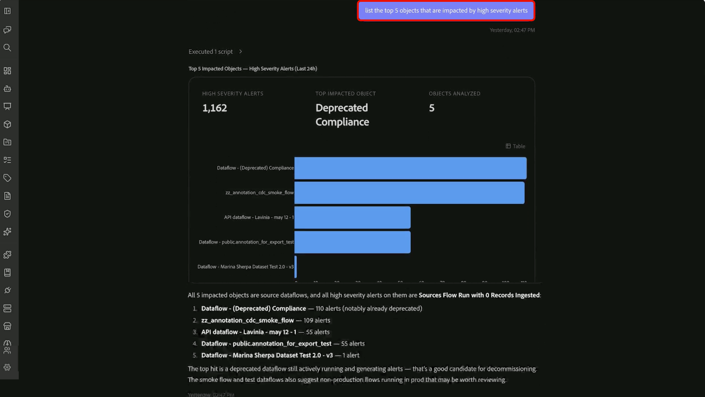

# 고객 경고 기술

>[!AVAILABILITY]
>
> 고객 경고 기술은 Adobe CX Enterprise Coworker에 액세스할 수 있는 모든 고객이 사용할 수 있습니다.
>
> 고객 경고 기술을 사용하려면 Adobe Experience Platform 경고 및 해당 경고와 관련된 리소스에 대한 액세스 권한이 있어야 합니다.

CX Coworker 의 고객 경고 기술을 사용하여 경고 활동을 개인화된 운영 브리핑으로 전환할 수 있습니다. 최근 알림을 검토하고, 우선 순위가 높은 문제를 식별하고, 영향을 받는 리소스를 파악하고, 자연어 대화를 통해 조사 노력을 집중합니다.

고객 경고 기술은 경고 보기를 수동으로 검토하거나 여러 인터페이스에서 정보의 상관 관계를 확인하지 않고 경고 신호에서 실행 가능한 인사이트로 이동하는 데 도움이 됩니다. 최근 경고 활동에 대한 광범위한 질문으로 시작한 다음, 후속 질문을 사용하여 반복 경고 패턴을 식별하고, 영향을 받은 개체를 분석하고, 소유하고 있는 경고에 집중하십시오.

고객 경고에 대한 자세한 내용은 [고객 경고 개요](https://experienceleague.adobe.com/ko/docs/experience-platform/observability/alerts/overview)를 참조하십시오.

## 사전 요구 사항 {#prerequisites}

시작하기 전에 다음을 확인합니다.

- Adobe Experience Platform 액세스.
- 조직과 관련된 경고를 볼 수 있는 권한입니다.
- CX Coworker에 설치된 Adobe CXO 플러그인입니다.

플러그인 설치에 대한 지침은 https://experienceleague.adobe.com/ko/docs/cx-enterprise-coworker/content/chat/ui-guide을 참조하십시오.

## 고객 경고 기술 사용 {#use-customer-alert-skills}

자연어 요청을 사용하는 CX Coworker 를 통해 고객 경고 기술과 상호 작용할 수 있습니다. 경고 활동, 구독, 경고 트렌드 또는 영향을 받는 오브젝트에 대해 질문합니다. 후속 질문과 대화를 계속하여 결과를 구체화하고 분석에 집중합니다.

고객 경고 기술을 사용하려면

1. **[!UICONTROL CX 동료]**(으)로 이동합니다.

1. 경고에 대한 질문이나 요청을 입력합니다. 예:

   *&quot;지난 24시간 동안 트리거된 모든 경고를 나열하시겠습니까?&quot;*

   

1. 고객 경고 스킬에서 반환된 결과를 검토합니다.

   

1. 후속 질문을 통해 결과를 구체화합니다. 예:

   *&quot;지난 24시간 동안 트리거된 상위 3가지 유형의 경고를 표시합니다.&quot;*

   

1. 주의가 필요한 경고, 패턴 또는 영향을 받는 개체를 식별할 때까지 범위를 계속 좁힙니다. 예:

   *&quot;높은 심각도 경고의 영향을 받는 상위 5개의 개체를 나열합니다.&quot;*

   

고객 경고 기술은 대화 컨텍스트를 유지 관리하므로 이전 요청을 반복하지 않고 경고 활동에서 집중 조사로 진행할 수 있습니다.

## 지원되는 사용 사례 {#supported-use-cases}

고객 경고 기술을 사용하여 운영 활동을 모니터링하고, 문제를 조사하고, 역할과 가장 관련이 있는 경고에 집중할 수 있습니다.

### 경고 활동 검토

현재 경고 상태를 검토하거나 특정 기간 내의 내역 경고 활동을 조사합니다.

예:

- &quot;지난 24시간 동안 트리거된 경고는 무엇입니까?&quot;
- &quot;지난 7일 동안의 활성 경고를 표시합니다.&quot;

### 반복 경고 패턴 식별

조직에서 가장 자주 발생하는 경고 유형을 식별하려면 경고 내역을 검토하십시오. 대량의 개별 경고 이벤트를 검토하는 대신 고객 경고 기술을 사용하여 반복 패턴을 요약하고 주의가 필요할 수 있는 영역을 강조 표시합니다.

예:

- &quot;트리거된 상위 3개 경고 유형을 표시합니다.&quot;
- &quot;이번 달에 가장 많이 발생한 경고 유형은 무엇입니까?&quot;

### 우선 순위가 높은 문제에 집중

결과를 특정 심각도 수준으로 제한하여 조사 노력의 우선 순위를 지정합니다.

예:

- &quot;심각도가 높은 경고만 표시합니다.&quot;
- &quot;이번 주에 트리거된 중요한 경고는 무엇입니까?&quot;

### 경고의 영향 반경 이해

가장 빈번하게 영향을 받는 객체를 식별하고 조사를 시작해야 하는 위치를 파악합니다.

고객 경고 기술은 경고 활동을 분석하고 반복적이거나 심각도가 높은 경고와 관련된 객체를 표시하므로 운영에 가장 큰 영향을 미치는 영역에 집중할 수 있습니다.

예:

- &quot;영향을 받는 상위 5개 오브젝트는 무엇입니까?&quot;
- &quot;가장 심각도가 높은 경고와 연관된 객체는 무엇입니까?&quot;

### 영향을 받는 개체에 경고 유형 연결

경고 활동이 특정 리소스에 미치는 영향을 이해합니다.

고객 경고 기술은 영향을 받는 객체를 트리거한 경고 유형에 연결하여 패턴을 식별하고 작동 문제의 가능한 원인을 파악하는 데 도움이 됩니다.

예:

- &quot;어떤 경고 유형이 이 데이터 세트에 가장 자주 영향을 미쳤습니까?&quot;
- &quot;경고 유형과 영향을 받는 개체 간의 관계를 표시합니다.&quot;
- &quot;어떤 경고 유형이 가장 자주 영향을 받는 상위 오브젝트에 영향을 미칩니까?&quot;

### 내 경고에 집중

구독하고 모니터링을 담당하는 경고를 분석합니다.

[!DNL My Alerts] 환경을 사용하여 최근 활동을 검토하고, 심각도가 높은 문제에 우선 순위를 지정하고, 역할과 가장 관련이 있는 경고에 운영 분석을 집중하십시오.

예:

- &quot;내가 구독하는 심각도가 높은 경고를 표시합니다.&quot;
- &quot;이번 주에 트리거된 [!DNL My Alerts]의 경고는 무엇입니까?&quot;
- &quot;구독한 경고 중 주의가 필요한 것이 있습니까?&quot;

### 경고 구독 관리

자연어 대화를 통해 경고 구독을 검토하고 관리합니다.

예:

- &quot;어떤 경고를 구독하고 있습니까?&quot;
- &quot;이 경고를 구독하세요.&quot;
- &quot;이 경고에 대한 내 구독을 제거합니다.&quot;

## 프롬프트 예 {#example-prompts}

고객 경고 기술과 상호 작용할 때 다음 프롬프트를 예로 사용하십시오.

### 경고 활동 프롬프트

- &quot;지난 24시간 동안 무슨 일이 있었습니까?&quot;
- &quot;지난 24시간 동안 트리거된 경고는 무엇입니까?&quot;
- &quot;이번 주에 트리거된 모든 경고를 표시합니다.&quot;
- &quot;활성 경고가 있습니까?&quot;

### 경고 트렌드 프롬프트

- &quot;트리거된 상위 3개 경고 유형을 표시합니다.&quot;
- &quot;이번 달에 가장 많이 발생한 경고 유형은 무엇입니까?&quot;
- &quot;지난 7일 동안 어떤 경고 패턴을 보십니까?&quot;

### 심각도 분석 프롬프트

- &quot;심각도가 높은 경고만 표시합니다.&quot;
- &quot;지난 30일 동안의 중요한 알림을 표시합니다.&quot;
- &quot;어떤 심각도가 높은 경고가 가장 자주 발생합니까?&quot;

### 영향 분석 프롬프트

- &quot;영향을 받는 상위 5개 오브젝트는 무엇입니까?&quot;
- &quot;가장 많은 경고와 연관된 객체는 무엇입니까?&quot;
- &quot;경고 유형과 영향을 받는 개체 간의 관계를 표시합니다.&quot;
- &quot;어떤 경고 유형이 가장 자주 영향을 받는 상위 오브젝트에 영향을 미칩니까?&quot;

### 내 경고 프롬프트

- &quot;내가 구독하는 심각도가 높은 경고를 표시합니다.&quot;
- &quot;이번 주에 트리거된 [!DNL My Alerts]의 경고는 무엇입니까?&quot;
- &quot;내 구독한 경고 중 현재 활성 상태인 것이 있습니까?&quot;
- &quot;구독한 경고 중 주의가 필요한 것이 있습니까?&quot;

### 구독 관리 프롬프트

- &quot;어떤 경고를 구독하고 있습니까?&quot;
- &quot;이 경고를 구독하세요.&quot;
- &quot;이 경고에 대한 내 구독을 제거합니다.&quot;

## 다음 단계 {#next-steps}

이 안내서를 읽은 후에는 CX Coworker에서 고객 경고 기술을 사용하여 경고 활동을 검토하고, 경고 트렌드를 분석하고, 경고 구독을 관리하고, 자연어 대화를 통해 운영 문제를 조사하는 방법을 이해해야 합니다.

경고에 대한 자세한 내용은 [고객 경고 개요](https://experienceleague.adobe.com/ko/docs/experience-platform/observability/alerts/overview)를 참조하십시오.
