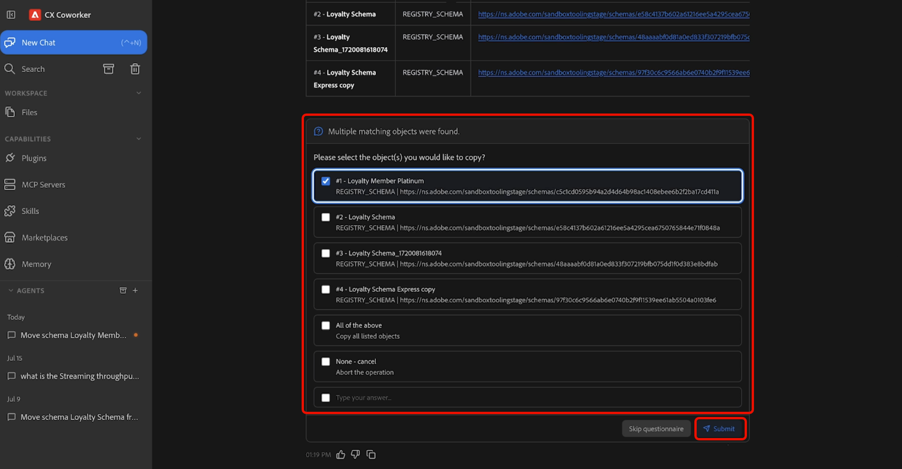
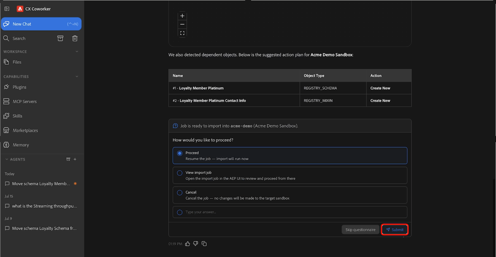

# 샌드박스 도구 에이전트 기술

>[!AVAILABILITY]
>
>샌드박스 툴링 에이전트 기술 은 Adobe CX Enterprise Coworker에 액세스할 수 있는 모든 고객이 사용할 수 있습니다. 사용 가능한 모든 기능을 사용하려면 다음 권한이 필요합니다.
>
>**Manage-sandbox** 또는 **View-sandbox**: 이 권한을 사용하면 샌드박스 도구 에이전트 기술을 사용하여 Coworker에서 직접 샌드박스를 볼 수 있습니다.
>
>**패키지 관리**: 이 권한을 사용하면 샌드박스 도구 에이전트 기술을 사용하여 Coworker에서 직접 패키지를 만들 수 있습니다.

>[!NOTE]
>
>현재 샌드박스 도구 에이전트 기술을 사용하여 스키마 및 대상 객체를 검색, 패키지 및 마이그레이션할 수 있습니다. 추가 오브젝트 유형에 대한 지원은 향후 릴리스에 추가될 예정입니다.

샌드박스 도구 에이전트 기술을 사용하여 자연어로 달성하고자 하는 작업을 설명함으로써 스키마 및 대상을 포함한 오브젝트 메타데이터를 Adobe Experience Platform 환경 간에 이동할 수 있습니다. CX Coworker를 사용하면 대화식 환경을 통해 필요한 메타데이터를 검색하고, 종속성을 자동으로 식별하며, 마이그레이션 패키지를 만들고, 개체를 마이그레이션할 수 있습니다.

## 사전 요구 사항 {#prerequisites}

시작하기 전에 다음을 확인합니다.

- Adobe Experience Platform 및 적절한 조직과 샌드박스에 액세스합니다.
- 검색하거나 마이그레이션하려는 개체에 액세스합니다.
- CX Coworker에 설치된 Adobe CXO 플러그인입니다.

플러그인 설치에 대한 지침은 [Coworker UI 안내서](https://experienceleague.adobe.com/en/docs/cx-enterprise-coworker/content/chat/ui-guide)를 참조하십시오.

## 샌드박스 도구 에이전트 기술 사용 {#use-sandbox-tooling-agentic-skills}

자연어를 사용하는 CX Coworker를 통해 샌드박스 툴링 에이전트 스킬과 상호 작용할 수 있습니다. 목표를 가능한 한 명확하게 설명하십시오. 모호하거나 지나치게 간략한 프롬프트가 낮은 품질의 결과를 반환하거나 에이전트를 호출하지 않을 수 있지만 특정 요청은 최상의 결과를 생성합니다.

샌드박스 도구 에이전트 기술을 사용하려면 다음을 수행합니다.

1. **[!UICONTROL CX 동료]**(으)로 이동합니다.
1. 수행할 작업에 대한 명확한 설명을 입력합니다. 예:

   *&quot;스키마 충성도 멤버 Platinum을 현재 샌드박스에서 Acme 데모 샌드박스로 이동합니다.&quot;*

1. 소스 및 대상 샌드박스를 보여주는 결과 테이블을 검토합니다. 계속할 준비가 되면 **[!UICONTROL 진행]**&#x200B;을 선택한 다음 **[!UICONTROL 제출]**&#x200B;을 선택하여 확인하십시오.

   ![계속을 선택하고 [제출]을 강조 표시한 요청 결과.](./assets/sandbox-tooling/results-proceed.png)

1. 마이그레이션하려는 개체를 하나 이상 선택한 다음 **[!UICONTROL 제출]**&#x200B;을 선택합니다.

   

1. 에이전트가 식별하는 개체 및 종속성을 검토하고 작업 동작(*새로 만들기* 또는 *기존 항목 사용*)을 확인합니다. 마이그레이션을 시작할 준비가 되면 **[!UICONTROL 계속]**&#x200B;을 선택한 다음 **[!UICONTROL 제출]**&#x200B;을 선택하여 확인하십시오. 마이그레이션이 완료되는 데 몇 분 정도 걸릴 수 있습니다.

   

1. 마이그레이션이 완료되면 선택한 오브젝트를 타겟 샌드박스에서 사용할 수 있습니다.

CX Coworker 사용에 대한 자세한 내용은 [Coworker UI 안내서](https://experienceleague.adobe.com/en/docs/cx-enterprise-coworker/content/chat/ui-guide)를 참조하십시오.

## 지원되는 사용 사례 {#supported-use-cases}

샌드박스 도구 에이전트 기술을 사용하여 샌드박스 관리 및 메타데이터 마이그레이션을 단순화하는 일반적인 방법을 살펴봅니다.

### 샌드박스 간 개체 메타데이터 이동

여러 Adobe Experience Platform 샌드박스를 관리하는 샌드박스 관리자는 사용자 인터페이스를 수동으로 탐색하는 대신 자연어 요청을 사용하여 개체 메타데이터를 마이그레이션할 수 있습니다.

CX Coworker를 사용하면 자연어로 마이그레이션을 설명함으로써 스키마, 대상 및 관련 구성 에셋을 포함한 객체 메타데이터를 한 샌드박스에서 다른 샌드박스로 마이그레이션할 수 있습니다. 샌드박스 툴 에이전트 스킬은 필요한 종속성을 자동으로 식별하고 패키지화하여 안정적인 마이그레이션을 보장합니다.

예:

> &quot;스키마 Luma 충성도 멤버 플래티넘을 현재 샌드박스에서 프로덕션 샌드박스로 이동합니다.&quot;

### 샌드박스 간 대상 프로모션

샌드박스 관리자는 대상을 수동으로 다시 만들거나 다시 구성하지 않고 환경 간에 대상을 승격할 수 있습니다.

예:

> &quot;대상 이름&quot; 대상을 스테이징 샌드박스로 홍보합니다.&quot;

샌드박스 도구 에이전트 스킬은 지정된 대상자를 식별하고, 해당 종속성을 확인하고, 모든 필수 개체를 대상 샌드박스로 마이그레이션합니다.

## 프롬프트 예 {#example-prompts}

샌드박스 도구 에이전트 스킬과 상호 작용할 때 다음 프롬프트를 예로 사용하십시오.

### 스키마 프롬프트

스키마 이름 및 대상 샌드박스를 알고 있는 경우 이러한 프롬프트를 사용합니다.

- &quot;스키마 &quot;스키마 이름&quot;을 현재 샌드박스에서 프로덕션 샌드박스로 이동합니다.&quot;

### 대상자 프롬프트

대상 이름을 알 때 이 프롬프트를 사용합니다.

- &quot;대상 이름&quot; 대상을 스테이징 샌드박스로 홍보합니다.&quot;

## 다음 단계 {#next-steps}

이 안내서를 읽은 후에는 샌드박스 도구 에이전트 기술을 사용하여 샌드박스 간에 지원되는 객체를 검색, 패키지 및 마이그레이션하는 방법을 이해해야 합니다.

샌드박스 도구에 대한 자세한 내용은 [샌드박스 도구 가이드](https://experienceleague.adobe.com/ko/docs/experience-platform/sandbox/ui/sandbox-tooling)를 참조하세요.
