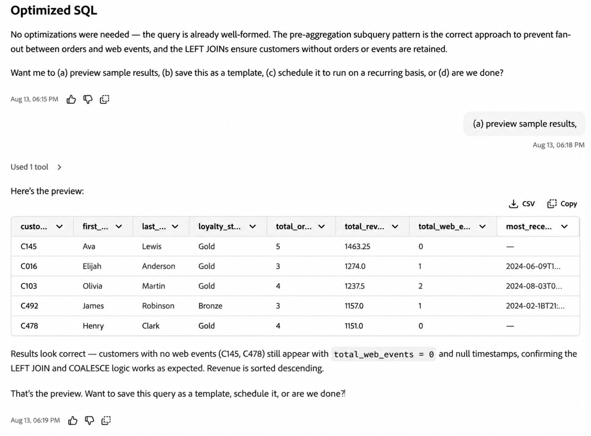

# Coworker의 SQL 데이터 준비

Coworker의 SQL 데이터 준비를 사용하여 자연어 프롬프트로 일반적인 [데이터 Distiller](https://experienceleague.adobe.com/ko/docs/experience-platform/query/data-distiller/overview) 작업을 수행합니다. SQL을 생성하고, 기존 쿼리의 문제를 해결하거나 최적화하고, 결과를 미리 보고, 반복 실행을 위한 쿼리를 예약할 수 있습니다.

>[!AVAILABILITY]
>
>Coworker의 SQL 데이터 준비는 제한된 가용성으로 사용할 수 있습니다.

## 사전 요구 사항 {#prerequisites}

Coworker에서 SQL 데이터 준비를 사용하기 전에 다음을 확인합니다.

- 데이터 Distiller 권한.
- 동료에 액세스.

## 시작하기 {#get-started}

시작하려면 Coworker를 열고 수행할 SQL 작업 또는 결과를 설명하는 자연어 요청을 입력합니다.

요청에 사용할 데이터 세트를 식별할 수 있습니다. 작업을 완료하는 데 추가 정보가 필요한 경우 동료는 계속하기 전에 후속 질문을 할 수 있습니다.

Coworker가 SQL을 생성하거나 업데이트한 후 대화를 계속하여 결과를 미리 보거나, 쿼리를 구체화하거나, 저장하거나, 반복 실행을 예약할 수 있습니다.

Coworker 인터페이스 사용에 대한 지침은 [Coworker UI 안내서](https://experienceleague.adobe.com/ko/docs/coworker/content/chat/ui-guide)를 참조하십시오.

## 지원되는 기능 {#supported-capabilities}

다음 작업에 SQL 데이터 준비를 사용할 수 있습니다.

| 기능 | 설명 |
| --- | --- |
| **SQL 작성** | 수행할 데이터 작업에 대한 자연어 설명으로 SQL을 생성합니다. |
| **SQL 최적화** | 기존 Data Distiller 쿼리를 분석하고 의도된 결과를 유지하면서 성능에 맞게 최적화합니다. |
| **SQL 오류 진단 및 수정** | 기존 SQL 쿼리의 오류를 진단하고 근본 원인을 설명하고 수정된 SQL을 생성합니다. |
| **쿼리 예약 및 알림** | 반복 실행을 위한 쿼리를 저장하고 예약하며 지원되는 쿼리 경고를 구성합니다. |

## 대화에서 SQL 데이터 준비 사용 {#work-with-sql-data-preparation}

SQL 데이터 준비 기능을 별도의 워크플로우로 처리하는 대신 동일한 공동 작업자 대화에서 결합할 수 있습니다.

예를 들어 다음 작업을 수행할 수 있습니다.

1. 원하는 결과를 설명하고 SQL을 생성합니다.
2. 최대 5개의 쿼리 결과 행을 미리 봅니다.
3. 쿼리를 세분화하거나 생성된 SQL에 대해 질문합니다.
4. 쿼리를 저장합니다.
5. 쿼리를 반복 실행하도록 예약하고 경고를 구성합니다.

동료는 적절한 데이터 세트를 확인하거나 일정에 대한 시간대를 확인하는 등 추가 정보가 필요할 때 후속 질문을 할 수 있습니다.

쿼리 미리 보기는 최대 5개의 행을 반환합니다. Experience Platform에서 직접 쿼리를 실행하고 작업하려면 [쿼리 편집기 UI 안내서](https://experienceleague.adobe.com/ko/docs/experience-platform/query/ui/user-guide)를 참조하세요.



### 자연어에서 SQL 생성 {#generate-sql}

달성하고자 하는 결과나 변환을 알고 있지만 Coworker가 해당 SQL을 생성하고자 하는 경우 SQL 작성을 사용하십시오.

올바른 데이터에서 SQL을 생성하기 위해 Coworker는 관련 데이터 세트를 식별하고 검증할 수 있습니다. 요청이 적절한 데이터 세트를 식별하는 데 충분한 정보를 제공하지 않는 경우 동료는 계속하기 전에 후속 질문을 할 수 있습니다.

예:

> 안녕하세요! test_luma_web_events_1000을 사용하여 이벤트 유형별로 고객 참여를 요약합니다. 이벤트 유형, 총 이벤트 및 고유 고객을 표시합니다. 이벤트 유형당 한 개의 행을 반환하고, 결과를 고유 고객별로 최고 고객부터 최저 고객까지 정렬합니다.

Coworker는 생성된 SQL을 반환하며 쿼리를 실행하여 결과를 미리 볼 수 있습니다.


Experience Platform에서 직접 쿼리를 만들고 실행하는 방법에 대한 자세한 내용은 [쿼리 편집기 UI 안내서](https://experienceleague.adobe.com/ko/docs/experience-platform/query/ui/user-guide)를 참조하십시오.

### 기존 SQL 최적화 {#optimize-sql}

Data Distiller 쿼리가 이미 있고 의도한 결과를 변경하지 않고 성능을 향상시키고자 하는 경우 SQL 최적화를 사용하십시오.

Coworker에 변경 내용을 설명하고 원본 및 최적화된 SQL을 비교하며 유효성 검사 또는 쿼리 계획 정보를 제공하도록 요청할 수 있습니다.

예:

> 정확히 동일한 결과를 유지하면서 데이터 Distiller 성능에 대한 다음 쿼리를 최적화합니다. 변경한 내용과 최적화된 쿼리가 논리적으로 동일한 이유를 설명합니다.
>
> ```sql
> SELECT
>         p.customer_id,
>         p.first_name,
>         p.last_name,
>         p.loyalty_status,
>         COUNT(o.order_id) AS total_orders,
>         SUM(CAST(o.order_total AS DOUBLE)) AS total_revenue
> FROM test_luma_profiles_1000 p
> INNER JOIN test_luma_orders_1000 o
>         ON p.customer_id = o.customer_id
> GROUP BY
>         p.customer_id,
>         p.first_name,
>         p.last_name,
>         p.loyalty_status
> ORDER BY total_revenue DESC;
> ```
>
> 전체 응답(특히 원본 SQL, 최적화된 SQL, 동등 항목 설명 및 EXPLAIN/유효성 검사 결과)을 보냅니다.

제공된 쿼리가 이미 최적화된 경우 Coworker는 수정이 필요하지 않음을 확인하고 해당 평가를 설명할 수 있습니다.


SQL 작성 기능을 통해 생성된 SQL은 이미 최적화되어 있습니다. 최적화를 위해 새로 생성된 SQL을 별도로 제출할 필요가 없습니다.

SQL 구문 및 지원되는 명령에 대해서는 [Query Service SQL 참조](https://experienceleague.adobe.com/ko/docs/experience-platform/query/sql/overview)를 참조하십시오.

### SQL 오류 진단 및 수정 {#diagnose-sql-errors}

기존 쿼리가 실패하여 원인을 식별하고 SQL을 수정하는 데 도움이 필요한 경우 SQL 오류 진단을 사용합니다.

Coworker는 쿼리를 분석하고 오류 원인을 식별하며 문제를 설명하고 수정된 SQL을 제공합니다.

예:

> 안녕하세요! 다음 쿼리가 실패했습니다. 오류를 진단하고 근본 원인을 설명한 다음 수정된 쿼리를 제공합니다.
>
> ```sql
> SELECT
>         o.order_id,
>         o.product_id,
>         p.product_name,
>         o.order_total
> FROM test_luma_orders_1000 o
> JOIN test_luma_product_catalog_1000 p
>         ON o.productid = p.productid;
> ```
>
> 수정된 쿼리는 두 데이터 세트의 적절한 제품 ID 필드를 사용해야 합니다.

쿼리를 수정한 후 동료에게 쿼리를 실행하고 결과를 미리 보도록 요청할 수 있습니다.


### 쿼리 예약 및 경고 구성 {#schedule-queries}

쿼리를 생성, 수정 또는 미리 본 후 대화를 계속하여 반복 실행을 위해 저장하고 예약할 수 있습니다.

예:

> 매일 오전 6시에 실행되도록 이 쿼리를 예약합니다. 쿼리가 실패할 경우 경고를 구성합니다.

필요한 정보가 누락되었거나 모호한 경우, 동료는 일정을 작성하기 전에 후속 질문을 합니다. 예를 들어 요청된 실행 시간과 연관된 시간대를 확인하도록 요청할 수 있습니다.

필요한 예약 세부 정보를 확인한 후 Coworker는 저장된 쿼리 템플릿, 일정, 시간대, 상태 및 실패 경고에 대한 요약을 반환합니다.


쿼리 일정, 되풀이 설정, 출력 데이터 세트 및 경고에 대한 자세한 내용은 [쿼리 일정](https://experienceleague.adobe.com/ko/docs/experience-platform/query/ui/query-schedules)을 참조하세요.

## 다음 단계 {#next-steps}

SQL 데이터 준비에서 사용하는 데이터 Distiller 및 쿼리 서비스 기능에 대한 자세한 내용은 다음 설명서를 참조하십시오.

- [데이터 Distiller 개요](https://experienceleague.adobe.com/ko/docs/experience-platform/query/data-distiller/overview)
- [쿼리 편집기 UI 안내서](https://experienceleague.adobe.com/ko/docs/experience-platform/query/ui/user-guide)
- [쿼리 일정](https://experienceleague.adobe.com/ko/docs/experience-platform/query/ui/query-schedules)
- [쿼리 서비스 SQL 참조](https://experienceleague.adobe.com/ko/docs/experience-platform/query/sql/overview)
