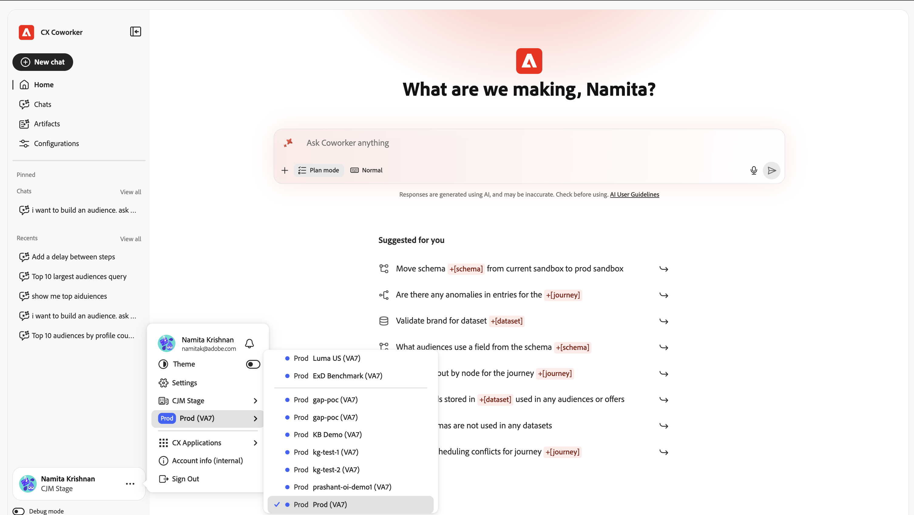
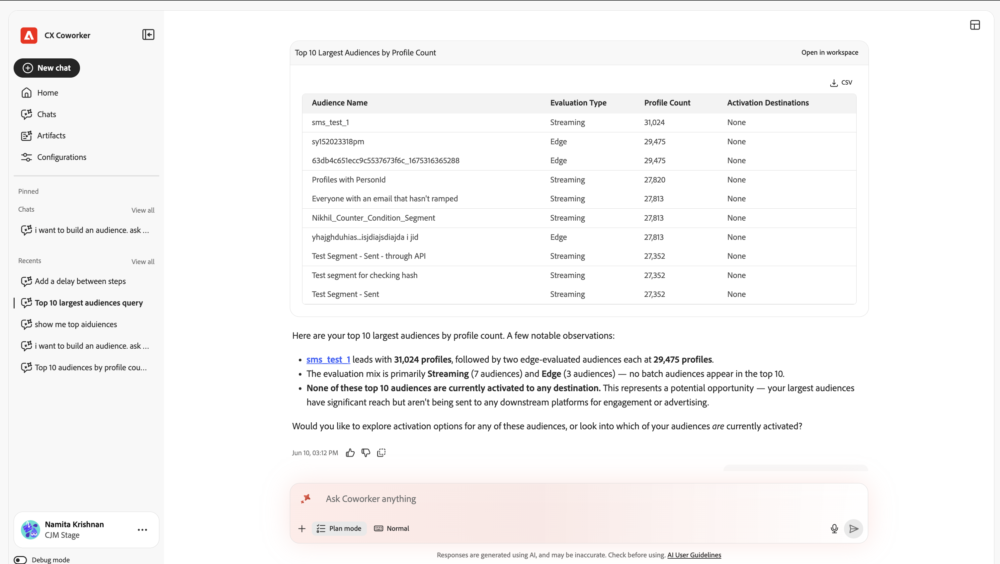

# UI 안내서 {#ui-guide}

Coworker Chat 인터페이스를 사용하여 환경을 최적화합니다. 이 안내서에서는 앱 액세스, 작업 영역 탐색부터 대화 최대화, 내역 관리, 설정 맞춤화에 이르기까지 모든 작업을 다룹니다.

## 동료 채팅 액세스

[https://experience.adobe.com/#/coworker](https://experience.adobe.com/#/coworker)&#x200B;(으)로 이동한 다음 Adobe 자격 증명으로 로그인하여 동료 채팅에 액세스합니다.

CX Enterprise의 위쪽 헤더에 있는 응용 프로그램 선택기에서 **Coworker**&#x200B;을(를) 선택하여 액세스할 수도 있습니다.

## 조직 및 샌드박스 선택

현재 컨텍스트는 왼쪽 탐색 레일의 하단에 이름과 프로필 사진 아래에 표시됩니다. 컨텍스트는 대화가 도달할 수 있는 데이터, 기술 및 연결된 도구를 결정하므로 시작하기 전에 이를 확인합니다.

이름을 선택하여 계정 메뉴를 엽니다. 여기서 컨텍스트를 전환하고 작업 공간 설정을 변경할 수 있습니다.

| 인터페이스 요소 | 설명 |
| --- | --- |
| 테마 | 인터페이스 테마를 밝음과 어둡음 사이에서 순환합니다. |
| 설정 | 작업 영역 설정을 열어 계정 및 기타 설정에 대한 세부 정보를 확인합니다. |
| 조직 선택기 | IMS 조직 동료 실행 전환 |
| 샌드박스 선택기 | 활성 AEP 샌드박스를 전환합니다. |
| CX 애플리케이션 | 계정에 연결된 다른 CX 엔터프라이즈 애플리케이션으로 이동합니다. |
| 로그아웃 | Adobe 계정에서 로그아웃합니다. |

## 인터페이스 살펴보기

CX Coworker 인터페이스에는 왼쪽의 탐색 레일과 나머지 창을 채우는 대화 캔버스라는 두 가지 기본 영역이 있습니다.

## 탐색 레일

레일을 통해 제품의 모든 부분과 최근 작업에 액세스할 수 있습니다.

| 인터페이스 요소 | 설명 |
| --- | --- |
| 새 채팅 | 새로운 대화를 시작하세요. 현재 채팅이 기록에 저장되었습니다. |
| 홈 | 인사말, 입력란 및 제안 프롬프트로 돌아갑니다. |
| 채팅 | 전체 채팅 기록을 열어 대화를 검색, 고정, 보관 또는 삭제합니다. |
| 구성 | 기술, MCP 서버, 마켓플레이스, 플러그인 및 메모리를 관리합니다. |
| 고정됨 | 여러분이 출연한 대화는 빠른 액세스를 위해 상단에 유지됩니다. 모두 보기 를 선택하여 채팅 페이지에서 확인합니다. |
| 최근 항목 | 가장 최근 대화입니다. 모두 보기 를 선택하여 채팅 페이지를 엽니다. |

## 홈 화면

홈 화면은 바로 시작하는 위치입니다. 여기에는 개인화된 인사말, 입력 상자 및 동료 채팅에서 샌드박스에서 수행하는 데 도움이 되는 제안 프롬프트 집합이 표시됩니다.

### 추천 프롬프트

제안 사항 아래에 CX Coworker에서 예제 작업을 나열합니다. 제안 사항을 선택하여 입력 상자에 로드한 다음 그대로 전송하거나 전송하기 전에 편집합니다. 제안은 샌드박스 간 스키마 이동, 여정에서 예외 항목 찾기, 데이터 세트 유효성 검사 등 동료가 지원하는 작업 종류를 빠르게 확인할 수 있는 방법입니다.

### 엔티티 언급

추천 프롬프트 및 자체 메시지는 +[스키마], +[여정] 및 +[데이터 세트]와 같은 엔티티 언급을 사용하여 샌드박스의 특정 개체를 참조할 수 있습니다. 엔터티 언급은 정확히 어떤 개체를 의미하는지 Coworker Chat에 알려주므로 **+**&#x200B;을(를) 입력하여 자신의 언급을 추가할 수 있습니다.

## 채팅 입력 상자

입력 상자(&#39;무엇이든 동료에게 묻기&#39;라고 레이블이 지정됨)는 사용자가 입력하는 위치입니다. 텍스트 필드 아래에는 첨부 파일, 응답 동작, 음성 입력 및 전송을 위한 도구 모음이 있습니다.

| 인터페이스 요소 | 설명 |
| --- | --- |
| + (첨부) | 첨부 메뉴를 열어 메시지에 파일이나 데이터 개체를 추가합니다. |
| 계획 모드 | 단계별 플랜을 제안하고 실행하기 전에 승인을 위해 일시 중지하도록 동료 채팅에 요청하십시오. 동료 채팅이 직접 작동하도록 하려면 이 기능을 끕니다. |
| 스크립트 보기 | Coworker Chat의 내부 활동(보통, 포커스 또는 세부 정보)을 표시하는 정도를 제어합니다. |
| 마이크 | 음성 입력으로 메시지를 받아쓰세요. 레코딩을 중단하려면 다시 선택하십시오. |
| 전송 | 메시지를 보냅니다. Coworker Chat이 응답하는 동안 이 옵션은 중단하는 데 사용할 수 있는 Stop 컨트롤이 됩니다. |

### 파일 및 데이터 첨부

메시지에 컨텍스트를 첨부하려면 +를 선택합니다.

- 파일 첨부: 동료 채팅이 응답에서 읽고 참조할 수 있는 파일을 업로드합니다.
- 데이터 또는 개체 추가: 데이터 세트 또는 스키마와 같은 샌드박스의 개체를 참조하므로 Coworker Chat이 라이브 데이터에 대해 작동합니다.

### 계획 모드

작업이 복잡하거나 데이터를 변경할 때 계획 모드를 켜고 먼저 접근 방식을 검토해야 합니다. 동료 채팅은 플랜에 응답하고 실행 전에 승인을 기다립니다. 플랜 모드가 꺼져 있으면 동료채팅이 바로 작품으로 진행된다.

### 스크립트 보기

대본 보기는 Coworker Chat의 추론 및 도구 활동이 대화에 인라인으로 표시되는 양을 설정합니다.

| 인터페이스 요소 | 설명 |
| --- | --- |
| 일반 | 균형 있는 관점: 주요 사고 단계와 도구 활동을 요약한다. |
| 포커스 | 주로 답을 볼 수 있도록 대부분의 중간 단계를 숨기는 간소화된 보기입니다. |
| 장황함 | 전체 세부 사항: 모든 사고 단계, 스킬 로드, 파일 읽기 및 쿼리. |

## 응답 작업

메시지를 보내면 Coworker Chat 은 열려 있는 작업을 통해 작동한 다음 해당 답변을 반환합니다. 응답은 추론, 사용된 도구의 기록 및 하나 이상의 아티팩트를 포함할 수 있다.

### 사고 및 활동

Coworker Chat은 작동 중이므로 프로세스를 따라가고 확인할 수 있도록 현재 진행 중인 작업을 보여 줍니다.

- 사고 블록: &quot;Thought for&quot;으로 레이블이 지정된 접을 수 있는 단계에 이어 초(또는 밀리초)가 표시됩니다. 한 가지를 확장하여 동료의 채팅 추론을 읽어보세요.
- 스킬 활동: 로드된 스킬 등의 항목은 Coworker Chat이 작업에 대해 가져온 전문 기능을 보여 줍니다.
- 파일 및 쿼리 활동: 파일 읽기 및 Ran 1 쿼리와 같은 항목은 Coworker Chat가 읽은 파일 및 실행된 쿼리를 각각 소요 시간과 함께 기록합니다.

>[!TIP]
>
>세부 정보(Verbose) 트랜스크립트 보기를 사용하여 모든 단계를 보거나 포커스(Focus)를 사용하여 숨길 수 있습니다.

### 아티팩트

Coworker Chat이 생성하는 결과(예: 대상자 테이블)는 응답 내에 아티팩트 카드로 표시됩니다. 아티팩트 카드에서 테이블 아티팩트를 CSV 파일로 다운로드할 수 있습니다. 응답에 여러 아티팩트가 포함된 경우 슬라이드 컨트롤(이전/다음 및 개수(예: 1/1))을 사용하여 두 아티팩트 사이를 이동합니다.

### 분석 읽기

Coworker Chat 은 아티팩트 아래에 그 결과가 무엇을 의미하는지 요약하여 주목할 만한 결과를 강조하고 다음에 취할 수 있는 후속 조치를 제안합니다.

### 피드백 제공 및 응답 복사

각 응답에는 평가 및 재사용을 위한 컨트롤이 있습니다.

- 엄지손가락 위로/엄지손가락 아래로: 응답을 평가하여 향후 응답을 개선합니다.
- 복사: Copy as Markdown(형식을 유지함) 또는 Copy as Plain Text를 사용하여 응답을 복사합니다.

## 채팅 관리

탐색 레일에서 채팅 을 선택하여 전체 기록을 엽니다. 대화는 날짜별로 그룹화되며 각 행에는 채팅 제목과 여기에 포함된 회전 횟수가 표시됩니다.

| 인터페이스 요소 | 설명 |
| --- | --- |
| 제목별 검색 | 이름으로 과거 대화를 찾습니다. |
| 고정 항목 표시 | 내가 출연한 대화만 표시합니다. |
| 보관된 항목 표시 | 보관된 대화를 표시합니다. |
| 새 채팅 | 새 대화를 시작하세요. |
| 행 메뉴(...) | 모든 대화에서 시작(고정), 이름 변경, 보관 또는 삭제합니다. |

## 구성

구성은 동료 채팅이 수행할 수 있는 작업을 사용자 지정하는 곳입니다. 여기에는 스킬, MCP 서버, 마켓플레이스, 플러그인, 메모리 등 5개의 탭이 있다.

### 스킬

스킬은 관련 있을 때 동료 채팅이 자동으로 호출하거나, 채팅에서 / 를 입력하여 트리거할 수 있는 전문 기능입니다. 스킬 탭에는 설치된 모든 스킬이 나열되며 더 추가할 수 있습니다.

- Source 추가: 새 소스에서 기술을 설치합니다.
- 검색: 이름으로 스킬을 찾습니다.
- 보기 변경: 보기 전환을 사용하여 그리드와 목록 레이아웃 간에 전환합니다.

세부 정보를 보려면 스킬을 선택합니다. 스킬이 속한 플러그인, 동료 채팅이 스킬을 사용하는 시기에 대한 설명 및 스킬에 포함된 모든 파일입니다. SKILL.md 보기를 선택하여 스킬의 전체 정의를 읽거나 Source 제거를 선택하여 제거합니다.

### MCP 서버

MCP(Model Context Protocol) 서버는 Coworker Chat를 Adobe Journey Optimizer, Real-Time CDP, Target 및 Workfront과 같은 외부 도구 및 서비스에 연결합니다. MCP 서버 탭에는 현재 연결된 모든 항목과 활성 상태인 연결 수가 나열됩니다.

- 서버 추가: 새 외부 도구 또는 서비스를 연결합니다.

각 카드에는 서버 이름, 종단점 및 제공되는 항목을 설명하는 모든 태그가 표시됩니다.

### 마켓플레이스

마켓플레이스는 찾아보고 설치할 수 있는 플러그인의 등록입니다. Marketplaces 탭을 사용하여 등록기를 추가하고 그룹별로 필터링할 수 있습니다.

- 마켓플레이스 추가: 새 플러그인 마켓플레이스를 등록합니다.
- 그룹별 검색/필터링: 목록의 범위를 좁혀 마켓플레이스를 찾습니다.

각 마켓플레이스에서 설치를 사용할 수 있게 되면 해당 소스와 준비 상태가 표시됩니다.

### 플러그인

플러그인은 함께 하나의 단위로 설치 및 관리되는 번들 스킬 및 MCP 서버로 Coworker Chat을 확장합니다. 플러그인 탭에 설치된 가 표시되며, 마켓플레이스에서 더 많은 을 추가할 수 있습니다.

- 마켓플레이스 찾아보기: 설치할 새 플러그인을 찾습니다.
- 제거: 설치된 플러그인과 모든 번들을 제거합니다.
- 마켓플레이스별로 필터링: 레지스트리에서 가져온 플러그인을 확인합니다.

### 메모리

메모리를 사용하면 Coworker Chat이 대화 전반에 걸쳐 사용자의 선호도를 기억하여 시간이 지나도 관련 있고 개인적인 반응을 유지할 수 있습니다.

- 메모리 활성화: 세션 간 메모리 켜기 또는 끄기.
- 저장된 환경 설정: Coworker Chat이 학습하고 저장한 환경 설정. 각 항목을 편집, 삭제 또는 검사할 수 있으며 항목별로 필터링할 수 있습니다.
- 저장된 메모리 내역: 저장된 메모리에 대한 변경 사항의 타임라인입니다.

