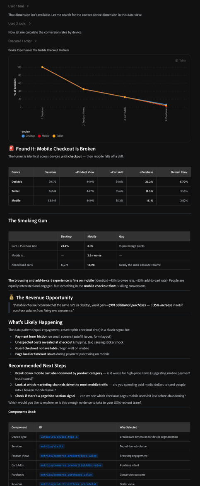

# 동료 채팅을 사용하여 Customer Journey Analytics 데이터 분석

Adobe CX Enterprise Coworker Chat 은 이전에 Analysis Workspace에서만 가능했던 고급 데이터 분석을 수행할 수 있습니다. Coworker Chat은 Customer Journey Analytics 데이터 보기에서 데이터에 액세스하여 해당 데이터를 탐색하고 자연어 프롬프트에 대한 답변을 얻을 수 있습니다.

필요한 분석의 양에 따라 두 가지 방법으로 Coworker Chat을 사용할 수 있습니다.

* **빠른 답변** - 간단한 언어를 직접 질문하고 즉시 답변을 받으십시오. 비즈니스 사용자들은 이러한 방식으로 동료 채팅을 사용하는 경우가 많으며, 분석가들은 이해 관계자를 위한 빠른 답변이 필요할 때도 이를 사용합니다.
* **깊이 있는 생각 작업** - Coworker Chat과 여러 번 대화하여 비즈니스 문제를 조사하고, 원인을 배제하고, 권장 사항에 도달하십시오. 분석가는 일반적으로 이 접근 방식을 사용하여 권장 사항을 작성하기 전에 데이터를 심층적으로 탐색합니다.

시작하기 전에 Coworker 채팅 인터페이스 및 구성 옵션을 학습한 다음 Coworker가 Customer Journey Analytics 및 관련 데이터 보기에 연결되어 있는지 확인합니다.

## 동료 채팅 시작

### 데이터 액세스 및 권한

동료 채팅은 Customer Journey Analytics의 권한을 상속합니다. Analysis Workspace에서 사용할 수 있는 데이터 보기, 차원, 지표 및 세그먼트에만 액세스할 수 있습니다.

### 인터페이스 및 구성 옵션

Customer Journey Analytics 데이터로 Coworker Chat을 사용하기 전에 다음 기능에 대한 로그인 및 구성 옵션 관리 방법을 알아보십시오.

* 채팅 입력
* 대화
* 마켓플레이스
* MCP 서버
* 메모리
* 플러그인
* 스킬
* 기타

자세한 내용은 [동료 채팅 UI 안내서](/help/coworker/chat/ui-guide.md)를 참조하십시오.

### 동료 채팅을 사용하여 데이터를 분석할 때의 모범 사례

#### 조직 수준 우수 사례

* 조직의 분석가를 동료 챔피언으로 지정합니다.

* 사용자가 사용할 수 있는 데이터 및 구성 요소와 상관 관계가 있는 검증된 프롬프트 및 스킬 라이브러리를 만듭니다.

* 분석에 사용할 구성 요소만 사용하도록 Coworker Chat에 지시하는 스킬을 한 개 이상 만듭니다. 이렇게 하면 Coworker Chat이 조직의 사용자에게 가장 관련성이 높은 데이터를 제공하는 데 도움이 됩니다.

* 빠른 답변을 위해 동료 채팅에게 질문할 시점과 깊은 생각에 잠긴 작업에 사용할 시점에 대해 사용자에게 교육합니다.

#### 사용자 수준 우수 사례

* 계획 모드를 사용합니다.

  이 모드는 복잡한 작업에 특히 유용하지만, 동료가 행동하기 전에 후속 질문을 할 수 있기 때문에 간단한 작업에 대해 더 나은 결과를 얻을 수도 있습니다. 자세한 내용은 [플랜 모드](/help/coworker/chat/ui-guide.md#plan-mode)를 참조하세요.

* 프롬프트를 만들 때 가능한 한 구체적이어야 합니다.

  * 분석할 차원, 지표 및 날짜 범위의 이름을 지정합니다.
  * 정확한 이름으로 데이터 보기 구성 요소를 참조합니다.
  * 포함, 제외 또는 비교하려는 세그먼트, 대상, 채널 또는 장치를 지정합니다.
  * funnel, 트렌드 또는 집단 테이블 등 특정 시각화 유형을 원하는지 여부를 기술합니다.
  * 동료 채팅에서 후속 질문을 제안하려면 권장되는 다음 단계를 요청하십시오.
  * 지표를 예상할 때 &quot;다음 30일&quot;과 같은 예측 대상 기간을 요청합니다.
  * 이미 가지고 있는 가설을 언급하면 Coworker Chat이 이를 검증하거나 배제할 수 있습니다.
  * 지표 변경에 대한 분류를 원하는 경우 기여 차원을 요청합니다.
  * 리더십 또는 마케팅 팀과 같은 요약에 대한 대상자를 지정하고 결과를 제시하려는 경우 슬라이드 데크 개요를 요청합니다.
  * 데이터의 유효성을 검사할 때 비교할 특정 보고서 세트 및 데이터 보기의 이름을 지정합니다.
  * 먼저 분석을 완료한 다음 동료 채팅에 요청하여 기술로 저장해 두십시오. 그러면 명확하고 설명적인 이름이 지정되고 재사용할 빈도가 얼마나 되는지 알 수 있습니다.

* 동료 채팅 메모리에 표준 방향을 추가합니다. 예를 들어, 항상 동일한 데이터 보기의 데이터를 사용하는 경우 해당 데이터를 메모리에 추가합니다.

## 동료 채팅이 Customer Journey Analytics에 연결되어 있는지 확인합니다.

Coworker Chat에서 Coworker가 Customer Journey Analytics에 연결되어 있는지 확인합니다.

1. 왼쪽 레일에서 MCP 아이콘을 선택한 다음 연결된 MCP 서버 목록에서 [!UICONTROL **cja-mcp**]&#x200B;을(를) 사용할 수 있는지 확인하십시오.

   

1. (조건부) [!UICONTROL **cja-mcp**]&#x200B;이(가) 아직 연결되지 않은 경우 [!UICONTROL **MCP 서버 추가**]&#x200B;를 선택하고 [!UICONTROL **서버 이름**] 필드에 cja를 지정한 다음 표시될 때 선택한 다음 [!UICONTROL **서버 추가**]&#x200B;를 선택합니다.

## 올바른 데이터 보기에 연결

데이터 보기는 데이터를 해석하는 방법을 결정하는 Customer Journey Analytics의 컨테이너입니다.

Customer Journey Analytics의 다양한 데이터 보기에 액세스할 수 있으며 각 데이터 보기에는 Coworker에서 데이터를 분석할 때 사용할 수 있는 다양한 차원과 지표가 포함되어 있습니다.

### 사용할 데이터 보기 결정

답변할 질문 유형을 동료에게 알려 주고 해당 정보를 제공하는 액세스 권한이 있는 데이터 보기를 질문합니다. [데이터 보기를 메모리의 기본 설정으로 설정](#add-a-data-view-preference-in-memory)할 수도 있습니다.

**사용자:**

>[!BEGINSHADEBOX]

저는 고객 여정에서 고객들이 잠깐 들르는 학습에 관심이 있습니다. 내게 이 질문에 답할 수 있는 액세스 권한이 있는 Customer Journey Analytics의 데이터 보기는 무엇입니까?

>[!ENDSHADEBOX]

**동료 채팅 응답:**

>[!BEGINSHADEBOX]

세 개의 데이터 보기에 액세스할 수 있습니다. `Customer lifecycle` 데이터 보기에는 질문에 답변하는 데 가장 적합한 다음 차원과 지표가 포함되어 있습니다.

>[!ENDSHADEBOX]

**사용자:**

>[!BEGINSHADEBOX]

좋습니다. 해당 데이터 보기를 사용하겠습니다.

>[!ENDSHADEBOX]

**동료 채팅 응답:**

>[!BEGINSHADEBOX]

이 채팅 세션에서 향후 질문에 답변할 수 있도록 `Customer lifecycle` 데이터 보기를 사용합니다.

>[!ENDSHADEBOX]

### 메모리에 데이터 보기 환경 설정 추가

동료 채팅에는 모든 채팅에 적용되는 정보에 액세스할 수 있는 메모리 기능이 포함되어 있습니다. 선호하는 데이터 보기를 동료의 메모리에 환경 설정으로 추가하는 것이 좋습니다.

1. 동료 채팅의 왼쪽 탐색 메뉴에서 메모리 아이콘을 선택합니다.

1. 메모리 페이지의 [!UICONTROL **저장된 환경 설정**] 섹션에서 채팅에 사용할 Coworker Chat에 사용할 데이터 보기를 하나 이상 지정합니다.

   

## Customer Journey Analytics에서 분석

동료가 시각화를 만든 후 Analysis Workspace에서 열어 보다 심층적인 분석과 세분화된 제어를 수행할 수 있습니다. 시각화는 Customer Journey Analytics의 새 Analysis Workspace 프로젝트에서 열립니다.

새 Analysis Workspace 프로젝트에서 시각화를 열려면 다음을 수행하십시오.

1. Coworker에서 만든 시각화 옆에 있는 [!UICONTROL **CJA에서 분석**]&#x200B;을 선택합니다.

1. Customer Journey Analytics에서 시각화를 열면 Analysis Workspace 드래그 앤 드롭 브라우저 인터페이스를 사용하여 수정, 분석 추가, 대상 만들기 등을 할 수 있습니다. 선택한 모든 사람과 Workspace 프로젝트를 공유할 수도 있습니다.

   Analysis Workspace에 대한 자세한 내용은 [Analysis Workspace 개요](https://experienceleague.adobe.com/ko/docs/analytics-platform/using/cja-workspace/home)를 참조하십시오.

### Customer Journey Analytics 사용 사례

빠른 답변부터 깊이 있는 사고 작업 조사에 이르기까지 Adobe CX Enterprise Coworker Chat에서 실무자가 사용하는 Customer Journey Analytics 사용 사례와 샘플 프롬프트를 볼 수 있습니다. 각 프롬프트는 복사되고, 고유한 데이터와 컨텍스트에 맞게 조정되며, 대화를 통해 정제되도록 작성됩니다.

자세한 내용은 [사용 사례](/help/coworker/chat/use-cases/overview.md)를 참조하세요.

## Analytics 기술

Customer Journey Analytics 데이터를 분석하는 데 다음 기술을 사용할 수 있습니다.

### 데이터 쿼리 및 분석

이 스킬(`cja`)을 사용하면 Analysis Workspace에서 직접 요청을 빌드하지 않고도 Customer Journey Analytics을 실시간으로 쿼리하고 결과를 분석할 수 있습니다.

#### 필요한 권한

* 쿼리할 데이터 보기에 대한 액세스 권한 보기

#### 주요 사용 사례

| 사용 사례 | 함수 | 샘플 프롬프트 |
|---------|----------|---------|
| **보고서 및 지표 가져오기** | 실시간으로 Customer Journey Analytics을 쿼리하여 지표, 차원, 세그먼트 및 데이터 보기를 가져옵니다. | <ul><li>&quot;지난 30일 동안의 페이지 보기 횟수 표시&quot;</li><li>&quot;마스터 데이터 보기에 상위 세그먼트 나열&quot;</li></ul> |
| **비교 분석** | 채널, 기간 또는 세그먼트 간에 지표를 나란히 비교합니다. | <ul><li>&quot;월별 채널별 수익 비교&quot;</li><li>&quot;이번 분기에 모바일과 데스크탑 간 전환은 어떻게 보입니까?&quot;</li></ul> |
| **Funnel 분석** | 각 단계에서 드롭오프로 여러 단계의 전환 단계를 거칩니다. | <ul><li>&quot;체크아웃 funnel 안내&quot;</li><li>&quot;PDP에서 구매로 변환 funnel 표시&quot;</li></ul> |
| **예측** | 내역 데이터를 기반으로 향후 지표 값을 예상합니다. | <ul><li>&quot;향후 30일 동안의 세션 예측&quot;</li><li>&quot;매출 목표를 달성하는 데 도움이 됩니까?&quot;</li></ul> |

#### 범위 내

* 지표, 차원, 세그먼트 및 데이터 보기의 실시간 쿼리
* 채널, 기간 또는 세그먼트 간의 병렬 비교
* 여러 단계의 funnel 및 폴아웃 분석
* 과거 추세를 기반으로 한 지표 예측

#### 범위를 벗어남

* 데이터 보기 구성 요소 만들기 또는 편집
* 액세스 권한이 있는 데이터 보기 외부의 데이터
* 지표 예측을 뛰어넘는 예측 모델링

### 근본 원인 분석

이 스킬(`cja-root-cause-analysis`)은 지표가 변경되었음을 보고하는 대신 지표가 변경된 이유를 조사합니다.

#### 필요한 권한

* 분석 중인 데이터 보기에 대한 보기 액세스 권한

#### 주요 사용 사례

| 사용 사례 | 함수 | 샘플 프롬프트 |
|---------|----------|---------|
| **지표 변경 진단** | 드롭, 스파이크 및 예외 항목을 포함하여 지표가 변경된 이유를 조사합니다. | <ul><li>&quot;지난 주에 전환율이 떨어진 이유는 무엇입니까?&quot;</li><li>&quot;1월 15일 매출 급증의 원인은 무엇입니까?&quot;</li></ul> |

#### 범위 내

* 알려진 기간 동안 알려진 지표의 변경 조사
* 변경에 기여한 차원 및 세그먼트 표시

#### 범위를 벗어남

* 확인하지 않은 예외 항목 탐지(자동화된 경고 또는 실시간 경고 없음)
* 액세스 권한이 있는 데이터 보기 외부의 지표에 대한 근본 원인 분석

### 경영진 요약 및 성능 요약

이 스킬(`cja-executive-summary`)은 이해 당사자에게 준비된 Customer Journey Analytics 데이터 요약을 생성합니다.

#### 필요한 권한

* 요약에서 다루는 데이터 보기 또는 데이터 보기에 대한 액세스 권한 보기

#### 주요 사용 사례

| 사용 사례 | 함수 | 샘플 프롬프트 |
|---------|----------|---------|
| **성능 요약** | 관련자 대비 성능 요약, 규범적 권장 사항 및 슬라이드 데크 아웃라인을 생성합니다. | <ul><li>&quot;지난 달의 요약본을 주세요.&quot;</li><li>&quot;이번 분기의 데이터로 슬라이드 데크 아웃라인 만들기&quot;</li></ul> |

#### 범위 내

* 지정된 기간 동안의 성능 요약
* 데이터를 기반으로 규범적 권장 사항 생성
* 슬라이드 데크 또는 관련자 판독에 대한 콘텐츠 개요

#### 범위를 벗어남

* 최종 슬라이드 데크 또는 프레젠테이션 파일 구축
* 액세스 권한이 없는 데이터 보기를 포함하는 요약

### Adobe Analytics을 사용한 데이터 유효성 검사

이 스킬(`aa-cja-validation`)은 [!DNL Adobe Analytics]과(와) Customer Journey Analytics 간의 데이터를 비교, 감사 및 조정합니다.

#### 필요한 권한

* 비교 중인 [!DNL Adobe Analytics] 보고서 세트 및 Customer Journey Analytics 데이터 보기에 대한 액세스 권한 보기

#### 주요 사용 사례

| 사용 사례 | 함수 | 샘플 프롬프트 |
|---------|----------|---------|
| **Adobe Analytics에서 Customer Journey Analytics으로 업그레이드할 때 데이터 유효성 검사** | [!DNL Adobe Analytics]과(와) Customer Journey Analytics 간의 데이터를 비교, 감사 및 조정합니다.
자세한 내용은 [Adobe Analytics에서 Customer Journey Analytics으로 업그레이드할 때 Coworker를 사용하여 데이터 유효성 검사](data-validation-aa-cja.md)를 참조하십시오.
 | <ul><li>&quot;내 Adobe Analytics 보고서 세트를 내 Customer Journey Analytics 데이터 보기와 비교&quot;</li><li>&quot;Adobe Analytics과 Customer Journey Analytics 간 페이지 보기 횟수 유효성 검사&quot;</li></ul> |

#### 범위 내

* 보고서 세트와 데이터 보기 간의 지표 값 비교
* 두 데이터 소스 간의 불일치 플래그 지정

#### 범위를 벗어남

* 데이터 불일치의 근본 원인 해결
* [!DNL Adobe Analytics] 및 Customer Journey Analytics 이외의 데이터 원본 확인

### 사용자 지정 스킬 만들기

이 스킬(`cja-skill-creator`)은 이미 실행한 분석을 세션 간에 지속되는 재사용 가능한 스킬로 바꿉니다.

#### 필요한 권한

* 기술 관리

#### 주요 사용 사례

| 사용 사례 | 함수 | 샘플 프롬프트 |
|---------|----------|---------|
| **재사용 가능한 분석 패턴** | 분석 패턴을 재사용이 가능하고 반복 가능한 스킬로 변환하여 세션 간에 지속합니다. | <ul><li>&quot;이 주간 매출 분석을 재사용 가능한 스킬로 전환&quot;</li><li>&quot;월별 funnel 보고를 위한 스킬로 저장&quot;</li></ul> |

#### 범위 내

* 완료된 분석을 명명된 재사용 가능한 스킬로 변환
* 저장된 스킬을 향후 채팅 세션에서 사용할 수 있도록 설정

#### 범위를 벗어남

* 저장된 스킬을 다른 사용자와 자동으로 공유(조직 수준의 스킬 라이브러리는 관리자 설정이 필요)
* 스킬이 참조하는 데이터 보기 구성 요소 편집

## 예: 고객이 드롭오프하는 위치 찾기

직장 동료 채팅에 데이터를 사용하여 모든 비즈니스 질문을 분석하도록 요청할 수 있습니다.

예를 들어 마케팅 관리자, 머천다이저 또는 성장 주도자는 고객이 어디에서 구매 경로를 포기하는지, 왜 구매했는지, 전환율을 높이기 위해 수행할 수 있는 작업에 대해 알고 싶을 수 있습니다.

>[!NOTE]
>
>아래 그림은 대화 모양을 표시하는 데 사용되는 가상의 retailer [!DNL TechPulse Electronics]에 대한 예제 데이터입니다.

### 질문 유형

폴아웃 시각화가 무엇인지, 또는 어떤 지표가 어느 슬롯에 배치되는지 알 필요는 없습니다. 대신 중요한 결과를 일반 언어로 설명하십시오.

* &quot;구매하는 도중에 사람들이 줄어드는 곳은 어디입니까?&quot;
* &quot;제품 보기에서 체크아웃에 이르기까지 전체 전환 funnel은 무엇입니까?&quot;
* &quot;장바구니와 구매 중 어느 마케팅 채널이 가장 많이 누출됩니까?&quot;
* &quot;모바일이나 데스크탑에서 장바구니 포기가 더 심합니까?&quot;
* &quot;유료 소셜 환경의 사람들이 이메일의 사람들과 다르게 전환됩니까?&quot;

### 대화

#### &#x200B;1. 비즈니스 질문으로 시작

**사용자:**

>[!BEGINSHADEBOX]

구매하는 도중에 사람들이 어디에 빠지나요?

>[!ENDSHADEBOX]

**동료 채팅 응답:**

동료 채팅은 올바른 시각화를 선택하고, 터치포인트의 시퀀스를 지정하며, 권장되는 다음 단계를 추가합니다.

>[!BEGINSHADEBOX]

funnel 질문입니다. 전환 funnel을 실행하여 구매 경로에서 드롭오프가 발생하는 위치를 확인할 수 있습니다.

사람들을 잃는 이유가 여기 있습니다.

| Funnel 단계 | Count | 다음으로 전환 | 감소 |
| --- | --- | --- | --- |
| 세션 | 137,476 | 45.0% 제품 보기 | 55%가 제품 검색 없이 휴가 |
| 제품 보기 | 61,845 | 55.0% 장바구니에 추가 | 45% 찾아보지만 추가하지 않음 |
| 장바구니 추가 | 34,045 | 16.4% 구매 | 83.6% 장바구니 포기 |
| 구매 | 5,582 | — | — |

**중요한 결과: 구매할 장바구니가 가장 큰 누출임**

28,463명이 장바구니에 품목을 추가하지만 구매를 완료하지 못했습니다. 이는 83.6%의 장바구니에서 구매로 인한 감소 비율입니다. 단일 장애 지점에서 가장 큰 수치입니다.

**우선 순위에 대해 알려 주는 내용:**

| 우선 순위 | 문제 | 영업 기회 규모 |
| --- | --- | --- |
| #1 | 장바구니에서 구매 포기(83.6% 감소) | 28,463 잃어버린 구매자 |
| #2 | 제품 보기에 대한 세션(55% 찾아보기 안 함) | 75,631개 세션(제품 계약 없음) |
| #3 | 장바구니에 대한 제품 보기(45% 추가 안 함) | 27,800 관심이 있지만 커밋되지 않음 |

**다음 단계 권장:**

1. 마케팅 채널별로 장바구니 포기를 분류합니다. 장바구니에 추가하지만 구입하지 않는 저의도의 트래픽을 가져오는 특정 채널이 있습니까?
1. 디바이스 유형별 장바구니 포기 살펴보기 — 모바일 체크아웃 마찰이 전환을 종료합니까?
1. 어떤 제품이 가장 많이 포기되는지 확인 — 가격 문제? 깜짝 배송?

**다음 중 어떤 항목을 살펴볼까요?** 채널 분류는 실제 구매자와 비교하여 &quot;거의 구매자&quot;에게 전달하는 마케팅 작업을 직접 알려 줍니다.

>[!ENDSHADEBOX]

#### &#x200B;2. 누출 부분을 파고 들어라

**사용자:**

>[!BEGINSHADEBOX]

좋아요, 마케팅 채널별로 분류해봅시다

>[!ENDSHADEBOX]

**동료 채팅 응답:**

>[!BEGINSHADEBOX]

사용자 지정 **마케팅 채널** 차원이 있습니다. 이를 통해 funnel을 가져온 다음 채널별 전환율을 계산하고 각 채널이 누출되는 위치를 식별하겠습니다.

**평결: 유출은 채널별로 다릅니다**

이것은 정말 드러나는 결과이다. 다음은 채널별 funnel 분류입니다.

| 채널 | 세션 | 제품 보기로 변환 | 장바구니에 추가 | 구매하기 | 전체 전환 | 매출/세션 |
| --- | --- | --- | --- | --- | --- | --- |
| 유료 검색 | 43,958 | 45.1% | 54.6% | 16.6% | 4.09% | $499.58 |
| 유기 검색 | 31,492 | 44.9% | 54.9% | 16.9% | 4.17% | $494.76 |
| 직접 | 25,245 | 43.6% | 55.4% | 15.8% | 3.82% | $497.29 |
| 이메일 | 17,586 | 45.3% | 55.4% | 16.2% | 4.07% | $501.13 |
| 유료 소셜 | 12,684 | 45.4% | 55.7% | 16.0% | 4.03% | $512.17 |
| 표시 | 6,511 | 45.3% | 55.7% | 16.2% | 4.09% | $501.45 |

**주요 방법:**

1. 장바구니에서 구매로 드롭오프가 모든 채널에서 균일하게 잘못됨(83~84%). 즉, 모든 채널이 비슷한 비율로 사용자를 장바구니로 전환하므로 트래픽 품질에 대한 문제가 아닙니다. 누수는 마케팅이 아니라 체크아웃 경험 자체에 있습니다.
1. 어떤 채널도 전환에서 크게 더 우수하거나 더 나쁜 것은 없습니다. 전체 전환율은 3.8%와 4.2% 사이에서 긴밀하게 집계되며 세션당 매출은 거의 동일합니다($495-$512).
1. 볼륨에 미치는 영향이 가장 큰 경우: 유료 검색이 절대적으로 가장 많은 사람을 잃음(9,015개의 장바구니 포기)한 다음 유기 검색(6,449개의 손실)합니다. 이러한 기회는 가장 많은 트래픽을 유도하기 때문에 가장 큰 달러 가치 기회입니다.

**전략적으로 설명**

마케팅 채널들은 그들의 일을 하고 있습니다. 그들은 모두 사람들의 관심을 끌고 비슷한 비율로 장바구니에 추가합니다. 문제는 마케팅의 다운스트림입니다. 체크아웃 및 결제 흐름은 금액이 유출되는 위치입니다.

**다음 조사 권장:**

1. 모바일 장바구니 포기를 제품 범주별로 분류하면 가격이 높은 항목의 경우(모바일 결제 신뢰 문제 제안) 더 나쁠까요?
1. 가장 많은 모바일 트래픽을 유도하는 마케팅 채널을 확인하십시오. 사람들을 손상된 모바일 funnel으로 보내기 위해 유료 미디어 비용을 지출하고 있습니까?
1. 페이지 또는 사이트 섹션 신호가 있는지 확인합니다. 모바일 사용자가 중단하기 전에 마지막으로 히트한 체크아웃 페이지를 확인할 수 있습니까?

**다음 탐색할 각도**

>[!ENDSHADEBOX]

#### &#x200B;3. 계속 조사

**사용자:**

>[!BEGINSHADEBOX]

흥미롭군 장치 유형별로 분류해 보겠습니다.

>[!ENDSHADEBOX]

**동료 채팅 응답:**

>[!BEGINSHADEBOX]

**찾음: 모바일 체크 아웃이 끊어졌습니다**

funnel은 체크아웃할 때까지 디바이스 간에 동일하며 모바일은 낭떠러지에서 떨어집니다.

| 디바이스 | 세션 | 제품 보기로 변환 | 장바구니에 추가 | 구매하기 | 전체 전환 |
| --- | --- | --- | --- | --- | --- |
| 데스크탑 | 70,172 | 44.9% | 54.8% | 23.2% | 5.70% |
| 태블릿 | 13,855 | 44.7% | 55.6% | 14.3% | 3.56% |
| 모바일 | 53,449 | 44.9% | 55.3% | 8.1% | 2.02% |

**흡연 총**

| 지표 | 데스크탑 | 모바일 | 간격 |
| --- | --- | --- | --- |
| 장바구니에서 구매까지의 비율 | 23.2% | 8.1% | 15% 포인트 |
| 모바일은 | — | 2.8배 악화 | — |
| 포기한 장바구니 | 13,274 | 12,178 | 거의 동일한 절대 볼륨 |

검색 및 장바구니에 추가 경험은 모바일에서 괜찮습니다(동일한 ~45% 검색 비율, ~55% 장바구니에 추가). 사람들은 똑같이 관심이 있고 참여합니다. 그러나 모바일 체크아웃 흐름에서 전환율이 감소하는 문제가 발생했습니다.

**매출 기회**

모바일 체크아웃이 데스크톱과 동일한 속도로 전환되면 1회 경험을 수정하여 총 구매량이 35% 증가한 1,991건의 추가 구매를 할 수 있습니다.

**가능한 상황**

데이터 패턴(균등한 참여, 예외적인 체크아웃 드롭은 다음에 대한 일반적인 신호입니다.

* 작은 화면에서 결제 양식 마찰(자동 채우기 문제, 양식 레이아웃)
* 체크아웃 (배송, 세금)에서 드러나는 예기치 않은 비용 스티커 쇼크를 유발함
* 게스트 체크아웃을 사용할 수 없거나 모바일의 로그인 월
* 모바일에서 결제 처리 중 페이지 로드 또는 시간 초과 문제

**다음 단계 권장:**

1. 모바일 장바구니 포기를 제품 범주별로 분류하면 가격이 높은 항목의 경우(모바일 결제 신뢰 문제 제안) 더 나쁠까요?
1. 가장 많은 모바일 트래픽을 유도하는 마케팅 채널을 확인하십시오. 사람들을 손상된 모바일 funnel으로 보내기 위해 유료 미디어 비용을 지출하고 있습니까?
1. &quot;holiday_flash_sale&quot; 캠페인이 체크아웃 전환을 더 잘 했는지 확인 — 긴급도 기반 캠페인이 체크아웃 마찰을 극복할 수 있는지 확인

**어떤 항목을 살펴보시겠습니까, 아니면 UX 및 체크아웃 팀에 가져갈 수 있는 충분한 증거입니까?**

>[!ENDSHADEBOX]

#### &#x200B;4. 결정으로 전환합니다.

**사용자:**

>[!BEGINSHADEBOX]

그럼 어떻게 해야 하죠?

>[!ENDSHADEBOX]

**동료 채팅 응답:**

>[!BEGINSHADEBOX]

데이터에 근거해 볼 때, 여기에 집중해야 할 부분은 다음과 같습니다.

* **모바일 체크아웃을 수정합니다. 채널 문제가 아닙니다.** 모든 채널은 사람들을 비슷하고 건강한 비율로 장바구니로 전환하므로 광고 지출이 전반적으로 작동합니다. 매출은 특히 수정 사항이 포함된 모바일 체크아웃 플로우에서 손실되고 있습니다.
* **지불 및 양식 마찰로 시작하십시오.** 이러한 이유로 모바일 쇼핑객들이 장바구니를 포기하는 경우가 가장 많습니다. 모바일 지갑 옵션을 제공하고 양식을 단축하는 것이 일반적으로 가장 빠른 승수입니다.
* **수정 후 다시 확인합니다.** 체크아웃 변경 사항이 배송되면 모바일의 장바구니에서 구매까지의 비율이 데스크탑 비율인 23.2%로 이동하는지 확인하십시오.

추적할 수 있도록 이것을 프로젝트로 저장하거나, 모바일 장바구니에서 구매가 임계값 아래로 떨어지는 경우 경고를 설정하시겠습니까?

>[!ENDSHADEBOX]

### 무슨 일이 있었습니까

4가지 일반적인 언어 질문에서 Coworker는 다음을 지원했습니다.

* 여러 단계로 구성된 전환 funnel을 빌드하고 최대 누수로 장바구니에서 구매로 플래그 지정
* 마케팅 채널이 거의 동일한 속도로 누출되는 원인은 마케팅 채널 제외
* 실제 문제를 모바일 체크아웃으로 파악하고 구매 시 35% 상승도로 수정 사항을 수량화합니다.
* 우선 순위를 지정할 특정 수정 사항(모바일 결제 및 양식 마찰)을 사용하지 마십시오. 이는 데스크탑의 전환율 23.2%와 비교하여 벤치마킹되었습니다
