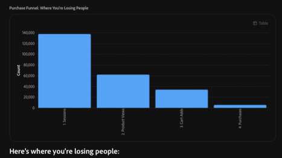
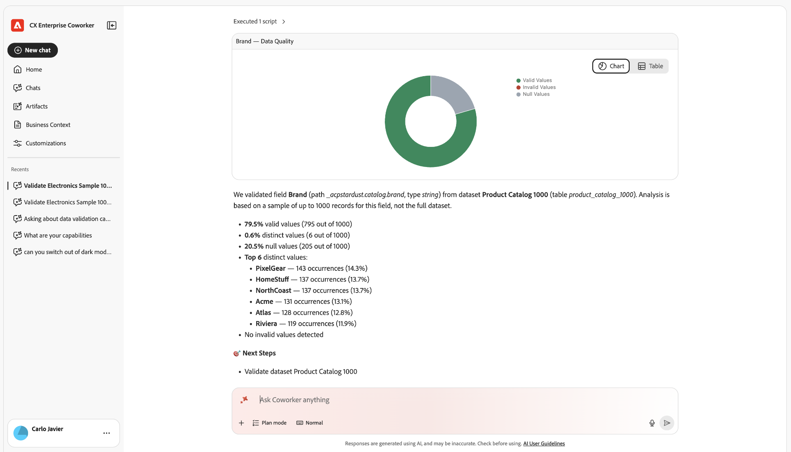

Adobe CX Enterprise Coworker Chat을 사용하면 팀이 자연어를 사용하여 Adobe 제품 작업을 자동화하고 유연한 계획, 사용자 정의 기술 및 지능형 실행을 통해 아이디어를 작업으로 신속하게 변환할 수 있습니다. Coworker에 대한 일반적인 정보는 [CX Enterprise Coworker 개요](/help/coworker/overview.md)를 참조하십시오.

## Coworker Chat 을 통한 데이터 분석

동료 채팅은 이전에 Analysis Workspace에서만 가능했던 고급 데이터 분석을 수행할 수 있습니다. Coworker Chat은 Customer Journey Analytics 데이터 보기 또는 Adobe Analytics 보고서 세트의 데이터에 액세스하여 해당 데이터를 탐색하고 자연어 프롬프트에 대한 답변을 얻을 수 있습니다.

언제든지 수동 제어를 위해 동료 채팅에서 만든 시각화를 열 수 있습니다.

## 동료 채팅에서 분석 시작

알기 원하는 내용을 쉬운 언어로 설명함으로써 시작하십시오. 공동 작업자 채팅은 분석을 계획하고, 데이터 보기 또는 보고서 세트를 쿼리하고, 시각화 및 요약을 만듭니다.

아래 사용 사례는 예입니다. 액세스 권한이 있는 모든 데이터에 대해 질문할 수 있습니다

### 주요 사용 사례

<!-- The following cards link to each of the stand-alone articles in this folder -->

<!--
CARDS

* https://experienceleague.adobe.com/en/docs/cx-enterprise-ai/experience-cloud-ai/coworker/chat/use-cases/data-insights/analytics-chat
  {title = Analyze Customer Journey Analytics and Adobe Analytics data}
  {description = Answers natural-language questions about your data views or report suites, builds funnels and other visualizations, and finds where customers drop off. You can open any visualization in Analysis Workspace for further analysis.}
  {cta = Read}
  {image = ../../assets/coworker-funnel-response-card.png}

* https://experienceleague.adobe.com/en/docs/cx-enterprise-ai/experience-cloud-ai/coworker/chat/use-cases/data-insights/root-cause-analysis
  {title = Explore trends and root causes}
  {description = Identifies trends in your Customer Journey Analytics and Adobe Analytics data and the factors that drive changes in performance, without manual queries.}
  {cta = Read}
  {image = ../../assets/data-validation-aa-cja/trend-line-card.png}
-->
<!-- START CARDS HTML - DO NOT MODIFY BY HAND -->

    

        

            

                <figure class="image x-is-16by9">
                    
                </figure>
            

            

                

                    

                        <a href="https://experienceleague.adobe.com/en/docs/cx-enterprise-ai/experience-cloud-ai/coworker/chat/use-cases/data-insights/analytics-chat" title="Customer Journey Analytics 및 Adobe Analytics 데이터 분석">Customer Journey Analytics 및 Adobe Analytics 데이터 분석</a>
                    

                    
데이터 보기 또는 보고서 세트에 대한 자연어 질문에 답변하고, 유입 경로 및 기타 시각화를 구축하며, 고객이 이탈하는 지점을 찾습니다. 추가적인 분석을 위해 Analysis Workspace에서 모든 시각화를 열 수 있습니다.

                

                <a href="https://experienceleague.adobe.com/en/docs/cx-enterprise-ai/experience-cloud-ai/coworker/chat/use-cases/data-insights/analytics-chat" class="spectrum-Button spectrum-Button--outline spectrum-Button--primary spectrum-Button--sizeM" style="align-self: flex-start; margin-top: 1rem;">
                    읽기
                </a>
            

        

    

    

        

            

                <figure class="image x-is-16by9">
                    
                </figure>
            

            

                

                    

                        <a href="https://experienceleague.adobe.com/en/docs/cx-enterprise-ai/experience-cloud-ai/coworker/chat/use-cases/data-insights/root-cause-analysis" title="트렌드 및 근본 원인 탐색">트렌드 및 근본 원인 살펴보기</a>
                    

                    
수동 쿼리 없이 Customer Journey Analytics 및 Adobe Analytics 데이터의 경향과 성능 변화를 주도하는 요인을 식별합니다.

                

                <a href="https://experienceleague.adobe.com/en/docs/cx-enterprise-ai/experience-cloud-ai/coworker/chat/use-cases/data-insights/root-cause-analysis" class="spectrum-Button spectrum-Button--outline spectrum-Button--primary spectrum-Button--sizeM" style="align-self: flex-start; margin-top: 1rem;">
                    읽기
                </a>
            

        

    

<!-- END CARDS HTML - DO NOT MODIFY BY HAND -->

<!--
CARDS

* https://experienceleague.adobe.com/en/docs/cx-enterprise-ai/experience-cloud-ai/coworker/chat/use-cases/data-insights/implementation-guide
  {title = Plan your implementation}
  {description = Creates a personalized, step-by-step plan for implementing Customer Journey Analytics, upgrading from Adobe Analytics, or setting up Content Analytics, Marketing Campaign Analytics, or Streaming Media collection on the Edge. Plans include details such as owners, effort estimates, dependencies, and validation steps.}
  {cta = Read}
  {image = ../../assets/ui-guide-6.png}

* https://experienceleague.adobe.com/en/docs/cx-enterprise-ai/experience-cloud-ai/coworker/chat/use-cases/data-insights/intelligent-checklist
  {title = Generate an implementation checklist}
  {description = Turns your Customer Journey Analytics implementation plan into a checklist in Coworker Projects, where your team can assign steps, track status, and add approval gates.}
  {cta = Read}
  {image = ../../assets/data-validation-aa-cja/date-detail.png}
-->
<!-- START CARDS HTML - DO NOT MODIFY BY HAND -->

    

        

            

                <figure class="image x-is-16by9">
                    
                </figure>
            

            

                

                    

                        <a href="https://experienceleague.adobe.com/en/docs/cx-enterprise-ai/experience-cloud-ai/coworker/chat/use-cases/data-insights/implementation-guide" title="구현 계획">구현 계획</a>
                    

                    
Edge을 구현하거나, Adobe Analytics에서 업그레이드하거나, Content Analytics, Marketing Campaign Analytics 또는 Customer Journey Analytics에서의 스트리밍 미디어 컬렉션을 설정하기 위한 개인화된 단계별 플랜을 만듭니다. 계획에는 소유자, 작업량 예상, 종속성 및 유효성 검사 단계 등의 세부 사항이 포함됩니다.

                

                <a href="https://experienceleague.adobe.com/en/docs/cx-enterprise-ai/experience-cloud-ai/coworker/chat/use-cases/data-insights/implementation-guide" class="spectrum-Button spectrum-Button--outline spectrum-Button--primary spectrum-Button--sizeM" style="align-self: flex-start; margin-top: 1rem;">
                    읽기
                </a>
            

        

    

    

        

            

                <figure class="image x-is-16by9">
                    
                </figure>
            

            

                

                    

                        <a href="https://experienceleague.adobe.com/en/docs/cx-enterprise-ai/experience-cloud-ai/coworker/chat/use-cases/data-insights/intelligent-checklist" title="구현 체크리스트 생성">구현 검사 목록 생성</a>
                    

                    
Customer Journey Analytics 구현 계획을 Coworker Projects의 체크리스트로 전환하여 팀이 단계를 할당하고 상태를 추적하고 승인 게이트를 추가할 수 있습니다.

                

                <a href="https://experienceleague.adobe.com/en/docs/cx-enterprise-ai/experience-cloud-ai/coworker/chat/use-cases/data-insights/intelligent-checklist" class="spectrum-Button spectrum-Button--outline spectrum-Button--primary spectrum-Button--sizeM" style="align-self: flex-start; margin-top: 1rem;">
                    읽기
                </a>
            

        

    

<!-- END CARDS HTML - DO NOT MODIFY BY HAND -->

<!--
CARDS

* https://experienceleague.adobe.com/en/docs/cx-enterprise-ai/experience-cloud-ai/coworker/chat/use-cases/data-insights/data-validation-aa-cja
  {title = Validate data when upgrading from Adobe Analytics to Customer Journey Analytics}
  {description = Compares dimensions, metrics, and trends between your Adobe Analytics report suites and Customer Journey Analytics data views, then recommends fixes to support your upgrade.}
  {cta = Read}
  {image = ../../assets/data-validation-aa-cja/trend-bar-card.png}

* https://experienceleague.adobe.com/en/docs/cx-enterprise-ai/experience-cloud-ai/coworker/chat/use-cases/data-insights/streaming-media-validation
  {title = Validate your Streaming Media implementation}
  {description = Checks your datastream, schema, dataset, data view, and session data to confirm that streaming media tracking is configured and collecting data correctly.}
  {cta = Read}
  {image = ../../assets/ui-guide-8.png}
-->
<!-- START CARDS HTML - DO NOT MODIFY BY HAND -->

    

        

            

                <figure class="image x-is-16by9">
                    
                </figure>
            

            

                

                    

                        <a href="https://experienceleague.adobe.com/en/docs/cx-enterprise-ai/experience-cloud-ai/coworker/chat/use-cases/data-insights/data-validation-aa-cja" title="Adobe Analytics에서 Customer Journey Analytics으로 업그레이드 시 데이터 유효성 검사">Adobe Analytics에서 Customer Journey Analytics으로 업그레이드할 때 데이터 유효성 검사</a>
                    

                    
Adobe Analytics 보고서 세트와 Customer Journey Analytics 데이터 보기 간의 차원, 지표 및 트렌드를 비교한 다음, 업그레이드를 지원하도록 수정 사항을 권장합니다.

                

                <a href="https://experienceleague.adobe.com/en/docs/cx-enterprise-ai/experience-cloud-ai/coworker/chat/use-cases/data-insights/data-validation-aa-cja" class="spectrum-Button spectrum-Button--outline spectrum-Button--primary spectrum-Button--sizeM" style="align-self: flex-start; margin-top: 1rem;">
                    읽기
                </a>
            

        

    

    

        

            

                <figure class="image x-is-16by9">
                    
                </figure>
            

            

                

                    

                        <a href="https://experienceleague.adobe.com/en/docs/cx-enterprise-ai/experience-cloud-ai/coworker/chat/use-cases/data-insights/streaming-media-validation" title="스트리밍 미디어 구현의 유효성 검사">스트리밍 미디어 구현의 유효성 검사</a>
                    

                    
데이터 스트림, 스키마, 데이터 세트, 데이터 보기 및 세션 데이터를 확인하여 Streaming Media 추적이 구성되어 있고 데이터가 올바르게 수집되는지 확인합니다.

                

                <a href="https://experienceleague.adobe.com/en/docs/cx-enterprise-ai/experience-cloud-ai/coworker/chat/use-cases/data-insights/streaming-media-validation" class="spectrum-Button spectrum-Button--outline spectrum-Button--primary spectrum-Button--sizeM" style="align-self: flex-start; margin-top: 1rem;">
                    읽기
                </a>
            

        

    

<!-- END CARDS HTML - DO NOT MODIFY BY HAND -->

<!--
CARDS

* https://experienceleague.adobe.com/en/docs/cx-enterprise-ai/experience-cloud-ai/coworker/chat/use-cases/data-insights/validate-dataset-quality-for-cja
  {title = Validate dataset quality for Customer Journey Analytics}
  {description = Identifies the datasets that feed your Customer Journey Analytics reporting, then checks schemas, identity quality, and field quality so you can resolve issues before you build dashboards.}
  {cta = Read}
  {image = ../../assets/data-validation-aep/dataset-validation.png}

* https://experienceleague.adobe.com/en/docs/cx-enterprise-ai/experience-cloud-ai/coworker/chat/use-cases/data-insights/data-validation-aep
  {title = Validate data after ingestion into Experience Platform}
  {description = Runs statistical and semantic checks on Experience Platform datasets and fields to find data quality issues, such as invalid values or mapping problems.}
  {cta = Read}
  {image = ../../assets/data-validation-aep/null-values.png}
-->
<!-- START CARDS HTML - DO NOT MODIFY BY HAND -->

    

        

            

                <figure class="image x-is-16by9">
                    
                </figure>
            

            

                

                    

                        <a href="https://experienceleague.adobe.com/en/docs/cx-enterprise-ai/experience-cloud-ai/coworker/chat/use-cases/data-insights/validate-dataset-quality-for-cja" title="Customer Journey Analytics에 대한 데이터 세트 품질 유효성 검사">Customer Journey Analytics에 대한 데이터 세트 품질 확인</a>
                    

                    
Customer Journey Analytics 보고를 제공하는 데이터 세트를 식별한 다음 스키마, ID 품질 및 필드 품질을 검사하여 대시보드를 작성하기 전에 문제를 해결할 수 있습니다.

                

                <a href="https://experienceleague.adobe.com/en/docs/cx-enterprise-ai/experience-cloud-ai/coworker/chat/use-cases/data-insights/validate-dataset-quality-for-cja" class="spectrum-Button spectrum-Button--outline spectrum-Button--primary spectrum-Button--sizeM" style="align-self: flex-start; margin-top: 1rem;">
                    읽기
                </a>
            

        

    

    

        

            

                <figure class="image x-is-16by9">
                    
                </figure>
            

            

                

                    

                        <a href="https://experienceleague.adobe.com/en/docs/cx-enterprise-ai/experience-cloud-ai/coworker/chat/use-cases/data-insights/data-validation-aep" title="Experience Platform으로 수집 후 데이터 유효성 검사">Experience Platform으로 수집 후 데이터 유효성 검사</a>
                    

                    
Experience Platform 데이터 세트 및 필드에 대한 통계 및 시맨틱 검사를 실행하여 잘못된 값 또는 매핑 문제와 같은 데이터 품질 문제를 찾습니다.

                

                <a href="https://experienceleague.adobe.com/en/docs/cx-enterprise-ai/experience-cloud-ai/coworker/chat/use-cases/data-insights/data-validation-aep" class="spectrum-Button spectrum-Button--outline spectrum-Button--primary spectrum-Button--sizeM" style="align-self: flex-start; margin-top: 1rem;">
                    읽기
                </a>
            

        

    

<!-- END CARDS HTML - DO NOT MODIFY BY HAND -->

사용 기술과 샘플 프롬프트를 포함하여 이러한 사용 사례에 대한 자세한 내용은 [데이터 인사이트 사용 사례](/help/coworker/chat/use-cases/overview.md#data-insights)를 참조하십시오.

### 시작하기

동료 채팅 을 통해 다음을 수행할 수도 있습니다.

* **성능 비교**: 채널, 기간 또는 세그먼트 간에 지표를 나란히 비교합니다.
* **캠페인 성과 측정**: 지정된 기간 동안 캠페인, 채널 및 웹 속성을 수행하는 방법을 확인하십시오.
* **단계 전환 단계 분석**: 여러 단계의 전환 단계를 거쳐서 각 단계에서 드롭오프를 확인합니다.
* **예측 지표**: 매출 목표를 달성하기 위한 적절한 과정에 있는지 여부와 같이 과거 Customer Journey Analytics 또는 Adobe Analytics 데이터의 향후 지표 값을 예상합니다.
* **경영진 요약 및 KPI 다이제스트 만들기**: 관련자가 사용할 수 있는 성능 요약, 권장 사항 및 슬라이드 데크 개요를 만듭니다.
* **운영 트렌드 및 원인 분석**: 대상, 데이터 세트 및 여정에 대한 기록 시계열 데이터를 쿼리하고 변경 원인을 식별합니다.
* **사용자 지정 Customer Journey Analytics 스킬 만들기**: 반복하는 분석을 세션 간에 지속되는 재사용 가능한 스킬로 전환합니다.

<!--
CARDS

* https://experienceleague.adobe.com/en/docs/cx-enterprise-ai/experience-cloud-ai/coworker/chat/use-cases/data-insights/analytics-chat
  {title = Analyze data with Coworker Chat}
  {description = Ask questions in natural language to build funnels, create visualizations, and find where customers drop off in the journey.}
  {cta = Read}
  {image = ../../assets/coworker-funnel-response-card.png}

* https://experienceleague.adobe.com/en/docs/cx-enterprise-ai/experience-cloud-ai/coworker/chat/use-cases/data-insights/root-cause-analysis
  {title = Explore trends and root causes}
  {description = Investigate changes in your Customer Journey Analytics data and uncover what drives them, without writing manual queries.}
  {cta = Read}
  {image = ../../assets/data-validation-aa-cja/trend-line-card.png}
-->
<!-- START CARDS HTML - DO NOT MODIFY BY HAND -->

    

        

            

                <figure class="image x-is-16by9">
                    
                </figure>
            

            

                

                    

                        <a href="https://experienceleague.adobe.com/en/docs/cx-enterprise-ai/experience-cloud-ai/coworker/chat/use-cases/data-insights/analytics-chat" title="동료 채팅을 사용하여 데이터 분석">동료 채팅으로 데이터 분석</a>
                    

                    
자연어로 질문하여 단계를 만들고 시각화를 만들며 여정에서 고객이 드롭오프하는 위치를 찾습니다.

                

                <a href="https://experienceleague.adobe.com/en/docs/cx-enterprise-ai/experience-cloud-ai/coworker/chat/use-cases/data-insights/analytics-chat" class="spectrum-Button spectrum-Button--outline spectrum-Button--primary spectrum-Button--sizeM" style="align-self: flex-start; margin-top: 1rem;">
                    읽기
                </a>
            

        

    

    

        

            

                <figure class="image x-is-16by9">
                    
                </figure>
            

            

                

                    

                        <a href="https://experienceleague.adobe.com/en/docs/cx-enterprise-ai/experience-cloud-ai/coworker/chat/use-cases/data-insights/root-cause-analysis" title="트렌드 및 근본 원인 탐색">트렌드 및 근본 원인 살펴보기</a>
                    

                    
수동 쿼리를 작성하지 않고도 Customer Journey Analytics 데이터의 변경 내용을 조사하고 변경 내용을 확인할 수 있습니다.

                

                <a href="https://experienceleague.adobe.com/en/docs/cx-enterprise-ai/experience-cloud-ai/coworker/chat/use-cases/data-insights/root-cause-analysis" class="spectrum-Button spectrum-Button--outline spectrum-Button--primary spectrum-Button--sizeM" style="align-self: flex-start; margin-top: 1rem;">
                    읽기
                </a>
            

        

    

<!-- END CARDS HTML - DO NOT MODIFY BY HAND -->

<!--
CARDS

* https://experienceleague.adobe.com/en/docs/cx-enterprise-ai/experience-cloud-ai/coworker/chat/use-cases/data-insights/validate-dataset-quality-for-cja
  {title = Validate Customer Journey Analytics data}
  {description = Check dataset quality with the data validation skill and resolve issues before you build dashboards.}
  {cta = Read}
  {image = ../../assets/data-validation-aep/dataset-validation.png}

* https://experienceleague.adobe.com/en/docs/cx-enterprise-ai/experience-cloud-ai/coworker/chat/use-cases/data-insights/data-validation-aa-cja
  {title = Validate data during your upgrade}
  {description = Compare Adobe Analytics and Customer Journey Analytics data to confirm that your upgrade is on track.}
  {cta = Read}
  {image = ../../assets/data-validation-aa-cja/trend-bar-card.png}
-->
<!-- START CARDS HTML - DO NOT MODIFY BY HAND -->

    

        

            

                <figure class="image x-is-16by9">
                    
                </figure>
            

            

                

                    

                        <a href="https://experienceleague.adobe.com/en/docs/cx-enterprise-ai/experience-cloud-ai/coworker/chat/use-cases/data-insights/validate-dataset-quality-for-cja" title="Customer Journey Analytics 데이터 유효성 검사">Customer Journey Analytics 데이터 유효성 검사</a>
                    

                    
대시보드를 작성하기 전에 데이터 유효성 검사 기술로 데이터 세트 품질을 확인하고 문제를 해결하십시오.

                

                <a href="https://experienceleague.adobe.com/en/docs/cx-enterprise-ai/experience-cloud-ai/coworker/chat/use-cases/data-insights/validate-dataset-quality-for-cja" class="spectrum-Button spectrum-Button--outline spectrum-Button--primary spectrum-Button--sizeM" style="align-self: flex-start; margin-top: 1rem;">
                    읽기
                </a>
            

        

    

    

        

            

                <figure class="image x-is-16by9">
                    
                </figure>
            

            

                

                    

                        <a href="https://experienceleague.adobe.com/en/docs/cx-enterprise-ai/experience-cloud-ai/coworker/chat/use-cases/data-insights/data-validation-aa-cja" title="업그레이드 도중 데이터 유효성 검사">업그레이드하는 동안 데이터 유효성 검사</a>
                    

                    
Adobe Analytics 및 Customer Journey Analytics 데이터를 비교하여 업그레이드가 제대로 진행되고 있는지 확인합니다.

                

                <a href="https://experienceleague.adobe.com/en/docs/cx-enterprise-ai/experience-cloud-ai/coworker/chat/use-cases/data-insights/data-validation-aa-cja" class="spectrum-Button spectrum-Button--outline spectrum-Button--primary spectrum-Button--sizeM" style="align-self: flex-start; margin-top: 1rem;">
                    읽기
                </a>
            

        

    

<!-- END CARDS HTML - DO NOT MODIFY BY HAND -->

## 주요 사용 사례의 표 레이아웃

<!-- The following table are links to each of the stand-alone articles in this folder -->

| 사용 사례 | 설명 |
| --- | --- |
| [Customer Journey Analytics 및 Adobe Analytics 데이터 분석](/help/coworker/chat/use-cases/data-insights/analytics-chat.md) | 데이터 보기 또는 보고서 세트에 대한 자연어 질문에 답변하고, 유입 경로 및 기타 시각화를 구축하며, 고객이 이탈하는 지점을 찾습니다. 추가적인 분석을 위해 Analysis Workspace에서 모든 시각화를 열 수 있습니다. |
| [트렌드 및 근본 원인 살펴보기](/help/coworker/chat/use-cases/data-insights/root-cause-analysis.md) | 수동 쿼리 없이 Customer Journey Analytics 및 Adobe Analytics 데이터의 경향과 성능 변화를 주도하는 요인을 식별합니다. |
| [구현 계획](/help/coworker/chat/use-cases/data-insights/implementation-guide.md) | Edge을 구현하거나, Adobe Analytics에서 업그레이드하거나, Content Analytics, Marketing Campaign Analytics 또는 Customer Journey Analytics에서의 스트리밍 미디어 컬렉션을 설정하기 위한 개인화된 단계별 플랜을 만듭니다. 계획에는 소유자, 작업량 예상, 종속성 및 유효성 검사 단계 등의 세부 사항이 포함됩니다. |
| [구현 검사 목록 생성](/help/coworker/chat/use-cases/data-insights/intelligent-checklist.md) | Customer Journey Analytics 구현 계획을 Coworker Projects의 체크리스트로 전환하여 팀이 단계를 할당하고 상태를 추적하고 승인 게이트를 추가할 수 있습니다. |
| [Adobe Analytics에서 Customer Journey Analytics으로 업그레이드할 때 데이터 유효성 검사](/help/coworker/chat/use-cases/data-insights/data-validation-aa-cja.md) | Adobe Analytics 보고서 세트와 Customer Journey Analytics 데이터 보기 간의 차원, 지표 및 트렌드를 비교한 다음, 업그레이드를 지원하도록 수정 사항을 권장합니다. |
| [스트리밍 미디어 구현의 유효성 검사](/help/coworker/chat/use-cases/data-insights/streaming-media-validation.md) | 데이터 스트림, 스키마, 데이터 세트, 데이터 보기 및 세션 데이터를 확인하여 Streaming Media 추적이 구성되어 있고 데이터가 올바르게 수집되는지 확인합니다. |
| [Customer Journey Analytics에 대한 데이터 세트 품질 확인](/help/coworker/chat/use-cases/data-insights/validate-dataset-quality-for-cja.md) | Customer Journey Analytics 보고를 제공하는 데이터 세트를 식별한 다음 스키마, ID 품질 및 필드 품질을 검사하여 대시보드를 작성하기 전에 문제를 해결할 수 있습니다. |
| [Experience Platform으로 수집 후 데이터 유효성 검사](/help/coworker/chat/use-cases/data-insights/data-validation-aep.md) | Experience Platform 데이터 세트 및 필드에 대한 통계 및 시맨틱 검사를 실행하여 잘못된 값 또는 매핑 문제와 같은 데이터 품질 문제를 찾습니다. |

사용 기술과 샘플 프롬프트를 포함하여 이러한 사용 사례에 대한 자세한 내용은 [데이터 인사이트 사용 사례](/help/coworker/chat/use-cases/overview.md#data-insights)를 참조하십시오.

