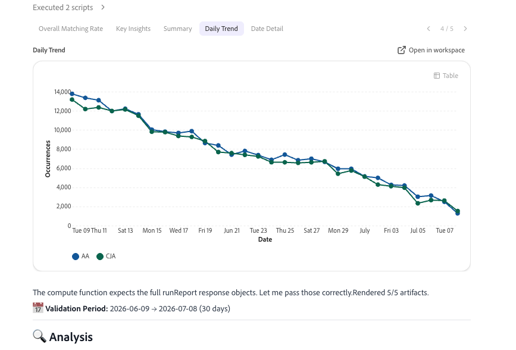

Adobe CX Enterprise Coworker Chat을 사용하면 팀이 자연어를 사용하여 Adobe 제품 작업을 자동화하고 유연한 계획, 사용자 정의 기술 및 지능형 실행을 통해 아이디어를 작업으로 신속하게 변환할 수 있습니다. Coworker에 대한 일반적인 정보는 [CX Enterprise Coworker 개요](/help/coworker/overview.md)를 참조하십시오.

## Coworker Chat 을 통한 데이터 분석

동료 채팅은 이전에 Analysis Workspace에서만 가능했던 고급 데이터 분석을 수행할 수 있습니다. Coworker Chat은 Customer Journey Analytics 데이터 보기 또는 Adobe Analytics 보고서 세트의 데이터에 액세스하여 해당 데이터를 탐색하고 자연어 프롬프트에 대한 답변을 얻을 수 있습니다.

언제든지 수동 제어를 위해 동료 채팅에서 만든 시각화를 열 수 있습니다.

## 동료 채팅에서 분석 시작

알기 원하는 내용을 쉬운 언어로 설명함으로써 시작하십시오. 공동 작업자 채팅은 분석을 계획하고, 데이터 보기 또는 보고서 세트를 쿼리하고, 시각화 및 요약을 만듭니다.

아래 사용 사례는 예입니다. 액세스 권한이 있는 모든 데이터에 대해 질문할 수 있습니다

## Analytics 사용 사례 및 기술

동료 채팅에는 다양한 사용 사례에 맞는 기술이 내장되어 있습니다. [동료 채팅 사용 사례, 기술 및 샘플 프롬프트](/help/coworker/chat/use-cases/overview.md#data-insights)

## 동료 채팅의 Analytics 기능 및 기술

<!--
CARDS

* https://experienceleague.adobe.com/en/docs/cx-enterprise-ai/experience-cloud-ai/coworker/chat/use-cases/data-insights/analytics-chat
  {title = Analyze data with Coworker Chat}
  {description = Ask questions in natural language to build funnels, create visualizations, and find where customers drop off in the journey.}
  {cta = Read}
  {image = ../../assets/coworker-funnel-response.png}

* https://experienceleague.adobe.com/en/docs/cx-enterprise-ai/experience-cloud-ai/coworker/chat/use-cases/data-insights/root-cause-analysis
  {title = Explore trends and root causes}
  {description = Investigate changes in your Customer Journey Analytics data and uncover what drives them, without writing manual queries.}
  {cta = Read}
  {image = ../../assets/data-validation-aa-cja/trend-line.png}

* https://experienceleague.adobe.com/en/docs/cx-enterprise-ai/experience-cloud-ai/coworker/chat/use-cases/data-insights/validate-dataset-quality-for-cja
  {title = Validate Customer Journey Analytics data}
  {description = Check dataset quality with the data validation skill and resolve issues before you build dashboards.}
  {cta = Read}
  {image = ../../assets/data-validation-aep/dataset-validation.png}

* https://experienceleague.adobe.com/en/docs/cx-enterprise-ai/experience-cloud-ai/coworker/chat/use-cases/data-insights/data-validation-aa-cja
  {title = Validate data during your upgrade}
  {description = Compare Adobe Analytics and Customer Journey Analytics data to confirm that your upgrade is on track.}
  {cta = Read}
  {image = ../../assets/data-validation-aa-cja/trend-bar.png}
-->
<!-- START CARDS HTML - DO NOT MODIFY BY HAND -->

    

        

            

                <figure class="image x-is-16by9">
                    
                </figure>
            

            

                

                    

                        <a href="https://experienceleague.adobe.com/en/docs/cx-enterprise-ai/experience-cloud-ai/coworker/chat/use-cases/data-insights/analytics-chat" title="동료 채팅을 사용하여 데이터 분석">동료 채팅으로 데이터 분석</a>
                    

                    
자연어로 질문하여 단계를 만들고 시각화를 만들며 여정에서 고객이 드롭오프하는 위치를 찾습니다.

                

                <a href="https://experienceleague.adobe.com/en/docs/cx-enterprise-ai/experience-cloud-ai/coworker/chat/use-cases/data-insights/analytics-chat" class="spectrum-Button spectrum-Button--outline spectrum-Button--primary spectrum-Button--sizeM" style="align-self: flex-start; margin-top: 1rem;">
                    읽기
                </a>
            

        

    

    

        

            

                <figure class="image x-is-16by9">
                    
                </figure>
            

            

                

                    

                        <a href="https://experienceleague.adobe.com/en/docs/cx-enterprise-ai/experience-cloud-ai/coworker/chat/use-cases/data-insights/root-cause-analysis" title="트렌드 및 근본 원인 탐색">트렌드 및 근본 원인 살펴보기</a>
                    

                    
수동 쿼리를 작성하지 않고도 Customer Journey Analytics 데이터의 변경 내용을 조사하고 변경 내용을 확인할 수 있습니다.

                

                <a href="https://experienceleague.adobe.com/en/docs/cx-enterprise-ai/experience-cloud-ai/coworker/chat/use-cases/data-insights/root-cause-analysis" class="spectrum-Button spectrum-Button--outline spectrum-Button--primary spectrum-Button--sizeM" style="align-self: flex-start; margin-top: 1rem;">
                    읽기
                </a>
            

        

    

    

        

            

                <figure class="image x-is-16by9">
                    
                </figure>
            

            

                

                    

                        <a href="https://experienceleague.adobe.com/en/docs/cx-enterprise-ai/experience-cloud-ai/coworker/chat/use-cases/data-insights/validate-dataset-quality-for-cja" title="Customer Journey Analytics 데이터 유효성 검사">Customer Journey Analytics 데이터 유효성 검사</a>
                    

                    
대시보드를 작성하기 전에 데이터 유효성 검사 기술로 데이터 세트 품질을 확인하고 문제를 해결하십시오.

                

                <a href="https://experienceleague.adobe.com/en/docs/cx-enterprise-ai/experience-cloud-ai/coworker/chat/use-cases/data-insights/validate-dataset-quality-for-cja" class="spectrum-Button spectrum-Button--outline spectrum-Button--primary spectrum-Button--sizeM" style="align-self: flex-start; margin-top: 1rem;">
                    읽기
                </a>
            

        

    

    

        

            

                <figure class="image x-is-16by9">
                    
                </figure>
            

            

                

                    

                        <a href="https://experienceleague.adobe.com/en/docs/cx-enterprise-ai/experience-cloud-ai/coworker/chat/use-cases/data-insights/data-validation-aa-cja" title="업그레이드 도중 데이터 유효성 검사">업그레이드하는 동안 데이터 유효성 검사</a>
                    

                    
Adobe Analytics 및 Customer Journey Analytics 데이터를 비교하여 업그레이드가 제대로 진행되고 있는지 확인합니다.

                

                <a href="https://experienceleague.adobe.com/en/docs/cx-enterprise-ai/experience-cloud-ai/coworker/chat/use-cases/data-insights/data-validation-aa-cja" class="spectrum-Button spectrum-Button--outline spectrum-Button--primary spectrum-Button--sizeM" style="align-self: flex-start; margin-top: 1rem;">
                    읽기
                </a>
            

        

    

<!-- END CARDS HTML - DO NOT MODIFY BY HAND -->

