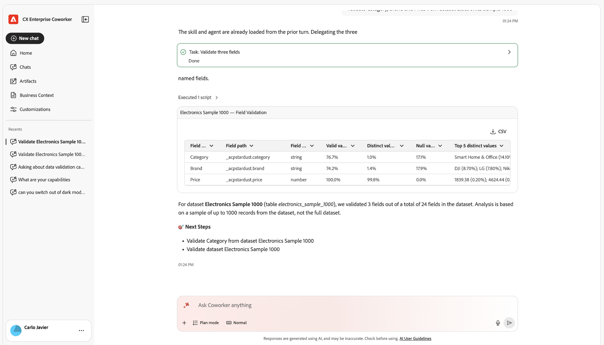
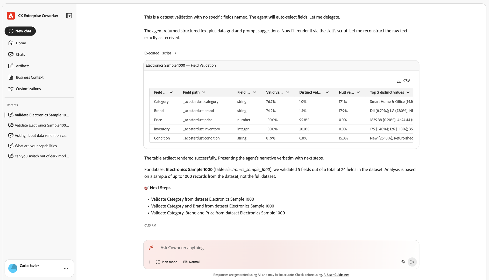

# Coworker를 사용하여 Experience Platform 데이터 유효성 검사

동료는 Experience Platform 데이터 세트의 데이터 품질을 확인하는 데이터 유효성 검사 기술을 포함합니다. 이 도구를 사용하여 단일 동료 채팅 대화를 통해 데이터 세트에 대한 통계 및 의미 체계 검증을 실행하고, 데이터 세트 필드를 분석하고, 데이터 품질 문제를 식별할 수 있습니다.

데이터 엔지니어, 데이터 관리자 및 구현 엔지니어는 SQL 쿼리나 복잡한 스키마 계층 없이 신속한 품질 검사에 사용합니다.

이 스킬을 사용하여 다음을 수행합니다.

* 새 구현 또는 구현 업데이트 후 주요 ID 및 이벤트 필드의 유효성을 검사합니다.
* 필드의 상위 값과 잘못된 값을 검사하여 의심되는 매핑 문제를 조사합니다.
* 중요한 데이터 세트에 대해 지속적인 데이터 관리 검사를 실행하여 회귀를 조기에 포착합니다.

<!--TODO: skill display name "Data Validation skill" confirmed via the published KT-22622 video page (validate-dataset-quality-for-cja.md, merged 2026-09-16). Still need the technical skill ID from engineering (Petru Adrian Snep) for the use-cases overview table row. That page didn't add one either.-->

>[!NOTE]
>
>이 스킬은 읽기 전용입니다. 데이터, 스키마 또는 매핑은 변경되지 않습니다.

## 시작하기에 앞서

Coworker를 사용하여 데이터의 유효성을 검사하려면 다음 작업을 수행해야 합니다.

* 유효성을 검사할 데이터 세트의 이름 또는 ID.
* (선택 사항) 스킬에서 필드를 자동으로 선택하지 않으려는 경우 유효성을 검사할 특정 필드의 이름.

## 유효성 검사 세션 시작

1. 동료에게 로그인합니다.

1. [!UICONTROL **새 채팅**]&#x200B;을 선택하세요.

1. 텍스트 필드에서 에이전트에게 필드 또는 데이터 세트의 유효성을 검사하라는 메시지를 표시합니다. 예:

   **프롬프트**

   > 데이터 세트 &quot;Electronics Sample 1000&quot;의 유효성 검사

   

   >[!TIP]
   >
   >스킬이 올바로 식별할 수 있도록 데이터 세트 이름에 &quot;dataset&quot;라는 단어를 추가하십시오. 예를 들어 &quot;Validate Electronics Sample 1000&quot; 대신 &quot;Validate the dataset Electronics Sample 1000&quot;을 사용합니다.

   요청은 데이터 세트의 샘플을 분석하고 동일한 대화에 대한 결과를 반환하는 데이터 유효성 검사 스킬로 라우팅됩니다.

## 확인할 항목 선택

단일 필드 또는 전체 데이터 세트의 유효성을 검사할 수 있습니다.

>[!BEGINTABS]

>[!TAB 필드 유효성 검사]

데이터 세트의 특정 필드를 확인합니다. 이 옵션은 다음을 제공합니다.

* Null 수 및 고유 값 수.
* 상위 개별 값 및 빈도입니다.
* 필드의 메타데이터 및 실제 값을 기반으로, 필드의 예상 형식과 일치하지 않는 값에 플래그를 지정하는 AI 지원 의미 체계 유효성 검사.

프롬프트 예:

* Customers_2024 데이터 세트에서 이메일 필드의 유효성을 검사합니다.
* customer_events_2024 데이터 세트의 필드 상태를 확인합니다.
* 고객 데이터 데이터 세트에 대한 field person.address.city 의 유효성을 검사합니다.

>[!TAB 데이터 집합 유효성 검사]

한 데이터 세트에 있는 최대 5개의 필드를 한 번에 확인합니다. 필드를 직접 지정하거나 스킬이 데이터 세트를 분석하고 가장 관련성이 높은 필드를 자동으로 선택하도록 할 수 있습니다. 이 옵션은 확인하는 모든 필드에 대해 필드 확인과 동일한 정보를 반환합니다.

프롬프트 예:

* 고객 데이터 2024 데이터 세트의 유효성을 검사합니다.
* 필드의 유효성 검사 이메일, Customers_2024용 전화.
* 고객 데이터에 대한 firstName, lastName, birthDate를 요약합니다.

>[!ENDTABS]

## 결과 검토

각 검증 필드의 경우, 다음 열이 있는 테이블에 행이 나타납니다.

| 열 | 설명 |
| --- | --- |
| [!UICONTROL 필드 이름] | 필드 이름입니다. |
| [!UICONTROL 필드 경로] | 스키마에서 필드의 전체 경로. |
| [!UICONTROL 필드 형식] | 필드의 데이터 형식입니다. |
| [!UICONTROL 유효한 값] | 유효성 검사를 통과한 샘플 값의 백분율입니다. |
| [!UICONTROL 고유 값] | 고유한 샘플링 값의 백분율입니다. |
| [!UICONTROL Null 값] | null인 샘플링 값의 백분율입니다. |
| [!UICONTROL 상위 5개 고유 값] | 5개의 가장 일반적인 값과 빈도입니다. |
| [!UICONTROL 상위 5개의 잘못된 값] | 가장 일반적인 5개의 잘못된 값, 각각에 대한 설명 포함(예: &quot;올바른 이메일 형식이 아님&quot;). |
| [!UICONTROL 추가 insight] | 필드의 품질에 대한 짧은 자연어 노트입니다. |

결과 아래에 Coworker는 **다음 단계** 목록을 추가하여 다른 필드의 유효성 검사나 데이터 집합 다시 실행과 같은 후속 프롬프트를 표시합니다.

단일 필드의 유효성을 검사하면 Coworker는 다음과 같은 차트도 반환합니다.

동일한 결과의 보기 간에 전환하려면 [!UICONTROL **차트**] 또는 [!UICONTROL **테이블**]&#x200B;을 선택하세요.

데이터 세트의 유효성을 검사하면 필드당 하나의 행으로 표에 결과가 표시됩니다. 지정한 대로 이름이 직접 지정된 필드가 표시됩니다.

스킬이 선택한 필드는 자동으로 다음과 같은 방식으로 표시됩니다.

전체 결과 테이블을 다운로드하려면 [!UICONTROL **CSV**]&#x200B;을(를) 선택하십시오.

## 데이터 유효성 검사로 수행한 검사

스킬은 각 필드 및 데이터 세트에 대해 다음 유형의 검사를 수행합니다.

* **완전성 확인**: null이고 누락된 개수 및 백분율입니다.
* **배포 확인**: 최상위 고유 값 및 해당 배포, 높은 카디널리티 검색.
* **스키마에 대한 의미 체계 검사**: XDM 필드 이름, 유형 및 설명을 사용하여 올바른 값이 어떻게 표시되는지 유추한 다음 예외 항목에 플래그를 지정합니다.
* 해당되는 경우 **데이터 형식 인식 검사**:
  * 이메일: 포맷 및 도메인 타당성.
  * 전화: 형식 준비(예: E.164)
  * 날짜 및 타임스탬프: 기본 형식 확인(예: ISO-8601).

이러한 검사는 결정론적 통계를 LLM 지원 의미론적 유효성 검사와 결합하여 스키마와 기술적으로 일치하더라도 잘못된 것처럼 보이는 값을 탐지합니다.

## 제한 사항

데이터의 유효성을 검사하기 전에 다음 제한 사항을 염두에 두십시오. 이러한 제약 조건은 성능과 기능의 균형을 맞추고 예상할 수 있는 분석 및 통찰력에 대한 기대를 설정합니다.

* **샘플링만**: 스킬이 전체 데이터 집합이 아닌 데이터 집합 샘플(일반적으로 가장 최근 1,000행)의 유효성을 검사합니다. 전체 데이터 세트 검색을 사용할 수 없습니다.
* **필드 수 제한**: 데이터 집합의 유효성을 검사할 때 스킬은 요청당 최대 5개의 필드를 분석합니다. 이러한 필드를 지정하거나 스킬이 필드를 자동으로 선택하도록 할 수 있습니다.
* **확률적 의미 체계**: 잘못된 값을 감지하는 것은 LLM 기반 추론을 부분적으로 사용하는데, 이는 간혹 미묘한 오류나 플래그 경계 값을 놓칠 수 있습니다.
* **읽기 전용**: 스킬이 데이터 또는 해당 스키마를 변경하지 않습니다. 잠재적인 문제를 강조하지만 자동화된 수정을 수행하지는 않습니다.

유효성 검사 요구 사항이 보다 포괄적이거나 복잡한 비즈니스 논리가 필요한 경우 쿼리 서비스 또는 데이터 준비 유효성 검사와 같은 추가 도구를 사용하여 이러한 결과를 보완하십시오.

**관련 정보**

* [업그레이드 시 Adobe Analytics에서 Customer Journey Analytics 데이터로의 유효성 검사](./data-validation-aa-cja.md)
* [Coworker의 데이터 유효성 검사 스킬을 사용하여 Customer Journey Analytics 데이터 유효성 검사](./validate-dataset-quality-for-cja.md)
* [데이터 유효성 검사(AI Assistant)](/help/agents/data-validation.md)
* [Customer Journey Analytics 보고 신뢰: Adobe CX Coworker의 데이터 유효성 검사 기술](https://www.youtube.com/watch?v=gCSm_QYSYhk)&#x200B;(비디오)
